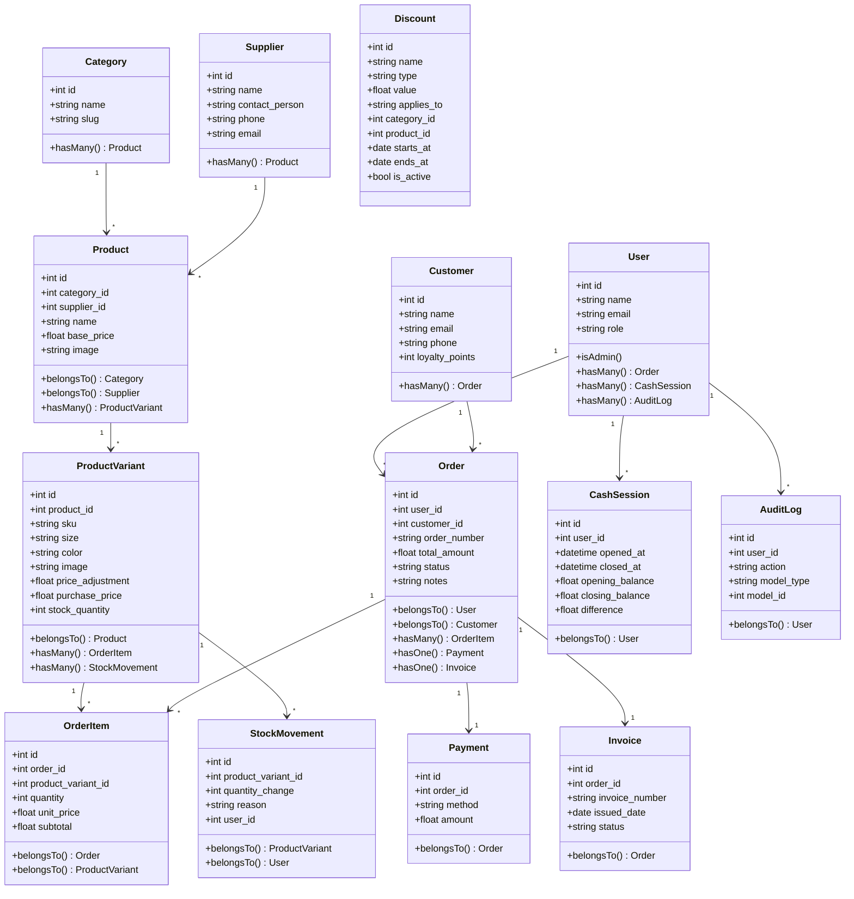

# SimpPOS — Project Specification

## 1. Overview

**SimpPOS** is a home-use Point of Sale system for clothing products with full invoice management, bilingual support (English / Burmese), and production-ready features. It uses a split architecture: **Laravel 13 API backend** with Sanctum token auth, and a **Vue 3 + TypeScript + Shadcn/vue SPA frontend**, backed by SQLite for zero-setup local storage.

---

## 2. Architecture

```
SimpPOS/
├── api/                    # Laravel 13 REST API
│   ├── app/
│   │   ├── Enums/                 # PHP enums
│   │   ├── Http/
│   │   │   ├── Controllers/Api/   # 17 API controllers
│   │   │   ├── Middleware/        # AdminMiddleware
│   │   │   ├── Requests/Api/      # 12 Form Requests
│   │   │   └── Resources/         # 14 API resource transformers
│   │   ├── Models/                # 13 Eloquent models
│   │   └── Services/              # InvoiceNumberGenerator
│   ├── database/
│   │   ├── factories/             # 11 model factories
│   │   ├── migrations/            # 18 migration files
│   │   └── seeders/               # DatabaseSeeder
│   ├── resources/views/pdf/       # PDF blade templates (invoice, receipt, label)
│   ├── routes/api.php
│   └── tests/Feature/Api/         # 16 test files (86 tests)
│
└── frontend/               # Vue 3 + TypeScript + Vite SPA
    ├── src/
    │   ├── components/
    │   │   ├── layout/            # AppSidebar, AppHeader, AppLayout
    │   │   └── ui/                # Shadcn-style components + NotificationToast, Pagination
    │   ├── lib/                   # Axios, utils, i18n-errors, theme, notify
    │   ├── locales/               # en.json, my.json
    │   ├── pages/                 # 18 page components
    │   ├── router/                # Vue Router with auth guards
    │   ├── stores/                # Pinia store (auth)
    │   └── types/                 # TypeScript interfaces
    ├── vite.config.ts
    └── package.json
```

---

## 3. Tech Stack

| Layer | Technology |
|---|---|
| Backend Framework | Laravel 13 |
| Auth | Sanctum (token-based) |
| Database | SQLite |
| Frontend Framework | Vue 3 + Composition API + TypeScript |
| Build Tool | Vite 8 |
| UI Library | Shadcn/vue (Tailwind-based) |
| State Management | Pinia |
| HTTP Client | Axios |
| i18n | vue-i18n (Composition API mode) |
| Charts | Chart.js + vue-chartjs |
| PDF | barryvdh/laravel-dompdf |
| Styling | Tailwind CSS v4 |
| Language | English (default) + Burmese (မြန်မာ) |
| Tests | PHPUnit (86 backend tests) |

---

## 4. Database Schema

### Tables & Fields

| Table | Fields |
|---|---|
| **users** | `id`, `name`, `email`, `password`, `role` (admin/staff), `remember_token`, `timestamps` |
| **categories** | `id`, `name`, `slug`, `description`, `timestamps` |
| **products** | `id`, `category_id` (FK), `supplier_id` (FK nullable), `name`, `slug`, `description`, `base_price`, `image`, `timestamps` |
| **product_variants** | `id`, `product_id` (FK), `sku` (unique), `size`, `color`, `image`, `price_adjustment`, `purchase_price`, `stock_quantity`, `timestamps` |
| **customers** | `id`, `name`, `email`, `phone`, `address`, `loyalty_points`, `timestamps` |
| **orders** | `id`, `user_id` (FK), `customer_id` (FK nullable), `order_number` (unique), `total_amount`, `status` (pending/completed/cancelled/refunded), `notes`, `timestamps` |
| **order_items** | `id`, `order_id` (FK), `product_variant_id` (FK), `quantity`, `unit_price`, `subtotal`, `timestamps` |
| **payments** | `id`, `order_id` (FK), `method` (cash/transfer), `amount`, `paid_at`, `timestamps` |
| **invoices** | `id`, `order_id` (FK unique), `invoice_number` (unique), `issued_date`, `due_date`, `status` (draft/issued/paid/cancelled/refunded), `notes`, `terms`, `timestamps` |
| **discounts** | `id`, `name`, `type` (percentage/fixed), `value`, `applies_to` (all/category/product), `category_id` (FK nullable), `product_id` (FK nullable), `starts_at`, `ends_at`, `is_active`, `timestamps` |
| **stock_movements** | `id`, `product_variant_id` (FK), `quantity_change`, `reason` (sale/adjustment/cancel/refund), `reference_type`, `reference_id`, `user_id` (FK nullable), `timestamps` |
| **suppliers** | `id`, `name`, `contact_person`, `phone`, `email`, `address`, `notes`, `timestamps` |
| **cash_sessions** | `id`, `user_id` (FK), `opened_at`, `closed_at`, `opening_balance`, `closing_balance`, `expected_balance`, `difference`, `notes`, `timestamps` |
| **audit_logs** | `id`, `user_id` (FK nullable), `action`, `model_type`, `model_id`, `old_values`, `new_values`, `ip_address`, `timestamps` |

### Relationships

```
User          ──1:N──> Order
User          ──1:N──> CashSession
Category      ──1:N──> Product
Supplier      ──1:N──> Product
Product       ──1:N──> ProductVariant
ProductVariant ──1:N──> OrderItem
Customer      ──1:N──> Order
Order         ──1:N──> OrderItem
Order         ──1:1──> Payment
Order         ──1:1──> Invoice
ProductVariant ──1:N──> StockMovement
```

---

## 5. Class Diagram



---

## 6. API Endpoints

### Auth
| Method | Endpoint | Description |
|---|---|---|
| POST | `/api/auth/login` | Login (rate-limited: 10/min) |
| POST | `/api/auth/logout` | Revoke current token |
| GET | `/api/auth/me` | Current user |

### Categories
| Method | Endpoint | Description |
|---|---|---|
| GET/POST/PUT/DELETE | `/api/categories` | Full CRUD |

### Products & Variants
| Method | Endpoint | Description |
|---|---|---|
| GET/POST/PUT/DELETE | `/api/products` | Full CRUD (paginated) |
| POST | `/api/products/{id}/image` | Upload product image |
| GET | `/api/products/export/csv` | Export products as CSV |
| POST | `/api/products/import/csv` | Import products from CSV |
| GET | `/api/products/{id}/labels` | Print barcode labels |
| PATCH | `/api/variants/{id}/stock` | Adjust stock |
| POST | `/api/variants/{id}/image` | Upload variant image |
| GET | `/api/variants/by-sku/{sku}` | Lookup variant by barcode |

### Customers
| Method | Endpoint | Description |
|---|---|---|
| GET/POST/PUT/DELETE | `/api/customers` | Full CRUD (paginated) |
| GET | `/api/customers/{id}/orders` | Customer order history |

### Suppliers
| Method | Endpoint | Description |
|---|---|---|
| GET/POST/PUT/DELETE | `/api/suppliers` | Full CRUD (paginated) |

### Discounts
| Method | Endpoint | Description |
|---|---|---|
| GET/POST/PUT/DELETE | `/api/discounts` | Full CRUD (paginated) |
| GET | `/api/discounts/active` | Active discounts for POS |

### Orders
| Method | Endpoint | Description |
|---|---|---|
| GET/POST | `/api/orders` | List (paginated) / Create |
| GET | `/api/orders/{id}` | Order detail |
| PATCH | `/api/orders/{id}/status` | Update status (cancel/refund) |
| POST | `/api/orders/{id}/return` | Item-level return |

### Invoices
| Method | Endpoint | Description |
|---|---|---|
| GET | `/api/invoices` | List (paginated) |
| GET | `/api/invoices/{id}` | Invoice detail |
| GET | `/api/invoices/{id}/print` | Print data |
| GET | `/api/invoices/{id}/pdf` | Download PDF |
| GET | `/api/invoices/{id}/receipt` | Thermal receipt view |

### Stock Movements
| Method | Endpoint | Description |
|---|---|---|
| GET | `/api/stock-movements` | List (paginated, filterable) |

### Cash Sessions
| Method | Endpoint | Description |
|---|---|---|
| GET | `/api/cash-sessions` | List |
| GET | `/api/cash-sessions/active` | Current open session |
| POST | `/api/cash-sessions/open` | Open register |
| POST | `/api/cash-sessions/close` | Close register |

### Backup
| Method | Endpoint | Description |
|---|---|---|
| POST | `/api/backup` | Create database backup |
| GET | `/api/backups` | List backups |
| GET | `/api/backups/{filename}/download` | Download backup file |

### Reports
| Method | Endpoint | Description |
|---|---|---|
| GET | `/api/dashboard/summary` | Dashboard summary |
| GET | `/api/reports/sales` | Sales report (date range) |
| GET | `/api/reports/best-sellers` | Top selling products |
| GET | `/api/reports/payment-methods` | Sales by payment type |

### Admin
| Method | Endpoint | Description |
|---|---|---|
| GET/POST/PUT/DELETE | `/api/users` | User management (admin only, paginated) |
| GET | `/api/audit-logs` | Audit log (admin only, paginated) |
| GET/PUT | `/api/profile` | Self profile management |

---

## 7. Frontend Routes & Pages

| Route | Page | Description |
|---|---|---|
| `/login` | LoginPage | Auth with EN/MY toggle |
| `/` | DashboardPage | Summary cards, sales chart (7/30d/month), backups, low stock, recent orders |
| `/pos` | POSPage | Product grid, variant dialog, cart, barcode scanning, discounts, checkout |
| `/products` | ProductListPage | Grid/list toggle, search, import/export CSV, pagination |
| `/products/new` | ProductFormPage | Create product with variants, images, cost, supplier |
| `/products/:id/edit` | ProductFormPage | Edit product with variant management |
| `/categories` | CategoryListPage | CRUD with inline form |
| `/suppliers` | SupplierListPage | CRUD with contact info |
| `/discounts` | DiscountListPage | CRUD with category/product targeting |
| `/customers` | CustomerListPage | Search, pagination |
| `/customers/:id` | CustomerDetailPage | Profile + order history |
| `/sales` | SalesListPage | Filters, pagination |
| `/sales/:id` | SaleDetailPage | Order detail + item-level return |
| `/invoices` | InvoiceListPage | Filters, pagination |
| `/invoices/:id` | InvoiceDetailPage | Print, receipt, PDF download |
| `/reports` | ReportsPage | Sales report, best sellers, payment methods |
| `/stock` | StockHistoryPage | Movement log with filters |
| `/cash-sessions` | CashSessionsPage | Open/close register, history |
| `/users` | UsersPage | Admin: manage users |
| `/audit-logs` | AuditLogPage | Admin: activity log |
| `/profile` | ProfilePage | Update own name/email/password |

---

## 8. Key Workflows

### POS Checkout Flow
```
Product Grid → Click Product → Variant Dialog (size/color with photos)
    → Add to Cart (right-side drawer with thumbnails)
    → Optionally search & add Customer
    → Optionally select Discount (all/category/product)
    → Review Cart → Enter Payment Amount
    → Complete Sale
    → Stock deducted, StockMovement logged, Order created, Invoice auto-generated
```

### Barcode Scanning Flow
```
Scanner inputs SKU string rapidly + Enter
    → Frontend detects fast keystrokes
    → GET /api/variants/by-sku/{sku}
    → Variant auto-added to cart with quantity 1
    → Toast: "Item added to cart"
```

### Discount Application
```
Discount created with type (percentage/fixed) and scope (all/category/product)
    → POS shows active discounts in dropdown
    → Frontend computes eligible items and shows preview
    → On sale: backend recalculates discount against matching items only
    → Discount label stored in order notes
```

### Return Flow
```
Sale Detail → Click "Return" → Check item checkboxes
    → Submit return with quantities and reasons
    → POST /api/orders/{id}/return
    → Stock restored per returned item
    → StockMovement logged
    → Order status → refunded, Invoice status → refunded
```

### Cash Session Lifecycle
```
Open Register (enter opening balance)
    → POS cash sales tracked during session
    → Close Register (enter closing balance)
    → System calculates expected = opening + cash orders
    → Difference = closing - expected
    → Session stored with diff for accountability
```

### Backup Flow
```
Dashboard → Click "Backup Now"
    → POST /api/backup
    → Copies database.sqlite to storage/app/backups/
    → Click download icon → GET /api/backups/{filename}/download
    → Browser downloads the .sqlite file
```

---

## 9. Security & Validation

- **Authentication**: Sanctum token-based (Bearer tokens)
- **Rate Limiting**: Login endpoint throttled to 10 requests per minute
- **Role-based Access**: Admin middleware for user management and audit log routes
- **Self-delete Guard**: Users cannot delete their own account
- **Order History Protection**: Cannot delete products/users/suppliers with existing order references
- **Stock Validation**: Validated at checkout; decrement uses atomic queries; double-cancel idempotent
- **Status Transitions**: Only valid transitions allowed (completed→cancelled→refunded)
- **File Uploads**: Image validation (mimes, max size)
- **Input Validation**: FormRequest classes for all endpoints
- **CSRF**: Enabled for web routes; API uses token auth
- **SQL Injection**: Protected by Eloquent ORM and parameterized queries

---

## 10. Testing

- **86 backend tests** across 16 test files (PHPUnit)
- Coverage: Auth, Categories, Products, Customers, Orders, Invoices, Discounts, Suppliers, Stock Movements, Cash Sessions, Returns, Variants, Reports, Dashboard, Users, Profile
- All tests run against SQLite in-memory database
- Run with: `cd api && php artisan test`

---

## 11. i18n & Localization

| Feature | English | Burmese |
|---|---|---|
| Language Code | `en` | `my` |
| Currency | Ks | Ks |
| API Errors | Translated on frontend | Translated on frontend |
| Validation | Custom key mapping | Custom key mapping |
| Direction | LTR | LTR |
| Fallback | — | `en` |

All UI text, nav labels, validation errors, and notifications are translated. The user's language preference is persisted in localStorage.

---

## 12. Dark Mode

- Class-based dark mode via Tailwind v4 `@custom-variant dark`
- Toggle persisted in localStorage
- System `prefers-color-scheme` detected on first visit
- All pages, cards, forms, tables, and components support both themes

---

## 13. Features Summary

| Feature | Status | Backend | Frontend |
|---|---|---|---|
| Auth (login/logout/me) | ✅ | AuthController | LoginPage |
| Categories CRUD | ✅ | CategoryController | CategoryListPage |
| Products with Variants | ✅ | ProductController | ProductListPage, ProductFormPage |
| Product/Variant Images | ✅ | Image upload endpoints | File input + in-line preview |
| Barcode by SKU Lookup | ✅ | VariantController@bySku | POS barcode detection |
| Barcode Labels | ✅ | Label blade template | Link on product page |
| CSV Import/Export | ✅ | ProductController | Buttons on product list |
| Suppliers | ✅ | SupplierController | SupplierListPage |
| Discounts (all/cat/product) | ✅ | DiscountController | DiscountListPage, POS selector |
| Customer Management | ✅ | CustomerController | CustomerListPage, CustomerDetailPage |
| POS Checkout | ✅ | OrderController | POSPage (grid, cart, discount, barcode) |
| Order Management | ✅ | OrderController | SalesListPage, SaleDetailPage |
| Item-level Returns | ✅ | OrderController@returnItems | Checkbox-based return panel |
| Invoice with PDF | ✅ | InvoiceController | InvoiceDetailPage |
| Thermal Receipt | ✅ | Blade template | Receipt button |
| Stock History | ✅ | StockMovementController | StockHistoryPage |
| Cash Management | ✅ | CashSessionController | CashSessionsPage |
| Dashboard | ✅ | DashboardController | DashboardPage (chart + backups) |
| Sales Report | ✅ | ReportController | ReportsPage |
| Best Sellers Report | ✅ | ReportController | ReportsPage |
| Payment Methods Report | ✅ | ReportController | ReportsPage |
| User Management | ✅ | UserController (admin) | UsersPage |
| Profile Management | ✅ | ProfileController | ProfilePage |
| Audit Log | ✅ | AuditLogController (admin) | AuditLogPage |
| Database Backup | ✅ | BackupController | Dashboard backup section |
| Pagination | ✅ | Paginate on all lists | Pagination component |
| Dark Mode | ✅ | — | Theme toggle in header |
| i18n EN/MY | ✅ | — | vue-i18n + local files |
| Notification System | ✅ | — | NotificationToast + useNotify |
| Error i18n | ✅ | — | i18n-errors.ts helper |
| Responsive Layout | ✅ | — | Mobile sidebar + responsive grids |
| Status Transition Guard | ✅ | OrderController | — |
| Admin Middleware | ✅ | AdminMiddleware | Router admin meta guard |
| Rate Limiting | ✅ | throttle middleware on login | — |
| 86 Backend Tests | ✅ | PHPUnit feature tests | — |
