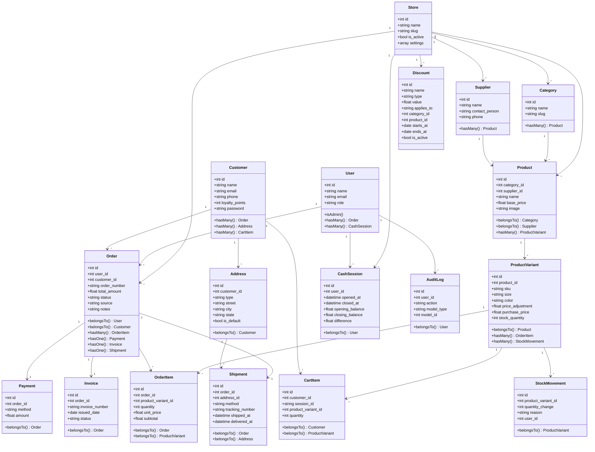

# SimpCommerce — Project Specification

## 1. Overview

**SimpCommerce** is a modular commerce platform for small-to-medium businesses with bilingual support (English / Burmese), multi-storefront e-commerce capability, and production-ready features. It includes a full POS module for in-store sales alongside customer-facing online shopping (cart, COD checkout, order management), all backed by a single API. It uses a split architecture: a **Laravel 13 API backend** (modular monolith, 14 modules) with Sanctum token auth, and a **Vue 3 + TypeScript + Shadcn/vue SPA frontend** for staff operations, backed by PostgreSQL (SQLite supported for testing and lightweight deployments).

---

## 2. Architecture

```
SimpCommerce/
├── api/                    # Laravel 13 REST API (modular monolith)
│   ├── app/
│   │   └── Modules/
│   │       ├── Core/           # Shared Kernel: ApiResponse, QueryFilter, Enums
│   │       ├── Identity/       # Auth, Users, Roles, Profile
│   │       ├── Store/          # Multi-store management
│   │       ├── Catalog/        # Products, Variants, Categories, Media
│   │       ├── Customer/       # CRM + Customer auth, Addresses
│   │       ├── Sales/          # Orders (POS + online), Invoices, Payments
│   │       ├── Inventory/      # Stock movements
│   │       ├── Promotion/      # Discounts
│   │       ├── Supplier/       # Vendors
│   │       ├── Cash/           # Cash drawer sessions
│   │       ├── Audit/          # Activity logging
│   │       ├── Report/         # Dashboard + analytics
│   │       ├── System/         # Backups, scheduled tasks
│   │       └── ECommerce/      # Cart, Checkout, Shipments, Customer orders
│   ├── database/
│   │   ├── factories/          # 11 model factories
│   │   ├── migrations/         # 25 migration files
│   │   └── seeders/            # DatabaseSeeder
│   ├── resources/views/pdf/    # PDF blade templates (invoice, receipt, label)
│   ├── routes/
│   │   ├── api.php             # Master 22-line route loader
│   │   └── modules/            # 14 per-module route files
│   └── tests/                  # 19 test files (136 tests)
│
└── frontend/               # Vue 3 + TypeScript + Vite SPA
    ├── src/
    │   ├── components/
    │   │   ├── layout/         # AppSidebar, AppHeader, AppLayout
    │   │   └── ui/             # Shadcn-style components + NotificationToast, Pagination
    │   ├── lib/                # Axios, utils, i18n-errors, theme, notify
    │   ├── locales/            # en.json, my.json
    │   ├── pages/              # 20 page components
    │   ├── router/             # Vue Router with auth guards
    │   ├── stores/             # Pinia store (auth)
    │   └── types/              # TypeScript interfaces
    ├── vite.config.ts
    └── package.json
```

---

## 3. Tech Stack

| Layer | Technology |
|---|---|
| Backend Framework | Laravel 13 |
| Auth | Sanctum (token-based) — two guards: `web` (staff) and `customer` |
| Database | PostgreSQL (SQLite for testing) |
| Frontend Framework | Vue 3 + Composition API + TypeScript |
| Build Tool | Vite 8 |
| UI Library | Shadcn/vue (Tailwind-based) |
| State Management | Pinia |
| HTTP Client | Axios |
| i18n | vue-i18n (Composition API mode) |
| Charts | Chart.js + vue-chartjs |
| PDF | barryvdh/laravel-dompdf |
| Styling | Tailwind CSS v4 |
| Language | English (default) + Burmese (မြန်မာ) |
| Tests | PHPUnit (136 backend tests) |

---

## 4. Database Schema

### Tables & Fields

| Table | Fields |
|---|---|
| **users** | `id`, `name`, `email`, `password`, `role` (admin/staff), `remember_token`, `timestamps` |
| **stores** | `id`, `name`, `slug` (unique), `description`, `is_active`, `settings` (JSON), `timestamps` |
| **categories** | `id`, `name`, `slug`, `description`, `store_id` (FK nullable), `timestamps` |
| **products** | `id`, `category_id` (FK), `supplier_id` (FK nullable), `store_id` (FK nullable), `name`, `slug`, `description`, `base_price`, `image`, `timestamps` |
| **product_variants** | `id`, `product_id` (FK), `sku` (unique), `size`, `color`, `image`, `price_adjustment`, `purchase_price`, `stock_quantity`, `timestamps` |
| **customers** | `id`, `name`, `email` (nullable unique), `phone`, `address`, `loyalty_points`, `password` (nullable), `email_verified_at`, `remember_token`, `timestamps` |
| **addresses** | `id`, `customer_id` (FK), `type`, `name`, `phone`, `street`, `city`, `state`, `postal_code`, `is_default`, `timestamps` |
| **orders** | `id`, `user_id` (FK), `customer_id` (FK nullable), `store_id` (FK nullable), `order_number` (unique), `total_amount`, `source` (pos/online), `status` (pending/completed/cancelled/refunded/processing/shipped/delivered), `notes`, `timestamps` |
| **order_items** | `id`, `order_id` (FK), `product_variant_id` (FK), `quantity`, `unit_price`, `subtotal`, `timestamps` |
| **payments** | `id`, `order_id` (FK), `method` (cash/transfer), `amount`, `paid_at`, `timestamps` |
| **invoices** | `id`, `order_id` (FK unique), `invoice_number` (unique), `issued_date`, `due_date`, `status` (draft/issued/paid/cancelled/refunded), `notes`, `terms`, `timestamps` |
| **discounts** | `id`, `name`, `type` (percentage/fixed), `value`, `applies_to` (all/category/product), `category_id` (FK nullable), `product_id` (FK nullable), `store_id` (FK nullable), `starts_at`, `ends_at`, `is_active`, `timestamps` |
| **stock_movements** | `id`, `product_variant_id` (FK), `quantity_change`, `reason` (sale/adjustment/cancel/refund), `reference_type`, `reference_id`, `user_id` (FK nullable), `timestamps` |
| **suppliers** | `id`, `name`, `contact_person`, `phone`, `email`, `address`, `notes`, `store_id` (FK nullable), `timestamps` |
| **cash_sessions** | `id`, `user_id` (FK), `store_id` (FK nullable), `opened_at`, `closed_at`, `opening_balance`, `closing_balance`, `expected_balance`, `difference`, `notes`, `timestamps` |
| **cart_items** | `id`, `customer_id` (FK), `session_id` (nullable UUID), `product_variant_id` (FK), `quantity`, `timestamps` |
| **shipments** | `id`, `order_id` (FK), `address_id` (FK), `method`, `tracking_number`, `tracking_url`, `shipped_at`, `delivered_at`, `notes`, `timestamps` |
| **audit_logs** | `id`, `user_id` (FK nullable), `action`, `model_type`, `model_id`, `old_values`, `new_values`, `ip_address`, `timestamps` |

### Relationships

```
Store         ──1:N──> Product, Category, Order, Discount, Supplier, CashSession
User          ──1:N──> Order, CashSession
Category      ──1:N──> Product
Supplier      ──1:N──> Product
Product       ──1:N──> ProductVariant
ProductVariant ──1:N──> OrderItem, StockMovement, CartItem
Customer      ──1:N──> Order, Address, CartItem
Order         ──1:N──> OrderItem
Order         ──1:1──> Payment, Invoice, Shipment
Address       ──1:N──> Shipment
```

---

## 5. Class Diagram



---

## 6. API Endpoints

### Staff Auth
| Method | Endpoint | Description |
|---|---|---|
| POST | `/api/auth/login` | Staff login (rate-limited: 10/min) |
| POST | `/api/auth/logout` | Revoke current token |
| GET | `/api/auth/me` | Current staff user |

### Staff Profile
| Method | Endpoint | Description |
|---|---|---|
| GET | `/api/profile` | View own profile |
| PUT | `/api/profile` | Update own name/email/password |

### User Management (Admin)
| Method | Endpoint | Description |
|---|---|---|
| GET | `/api/users` | List staff (paginated) |
| POST | `/api/users` | Create staff user |
| GET | `/api/users/{id}` | Show staff user |
| PUT | `/api/users/{id}` | Update staff user |
| DELETE | `/api/users/{id}` | Delete staff user |

### Categories
| Method | Endpoint | Description |
|---|---|---|
| GET | `/api/categories` | List |
| GET | `/api/categories/{id}` | Show |
| POST | `/api/categories` | Create (admin) |
| PUT | `/api/categories/{id}` | Update (admin) |
| DELETE | `/api/categories/{id}` | Delete (admin) |

### Products & Variants
| Method | Endpoint | Description |
|---|---|---|
| GET | `/api/products` | List (paginated) |
| GET | `/api/products/{id}` | Show |
| POST | `/api/products` | Create (admin) |
| PUT | `/api/products/{id}` | Update (admin) |
| DELETE | `/api/products/{id}` | Delete (admin) |
| POST | `/api/products/{id}/image` | Upload product image |
| GET | `/api/products/export/csv` | Export CSV |
| POST | `/api/products/import/csv` | Import CSV (admin) |
| GET | `/api/products/{id}/labels` | Print barcode labels |
| PATCH | `/api/variants/{id}/stock` | Adjust stock |
| POST | `/api/variants/{id}/image` | Upload variant image |
| GET | `/api/variants/by-sku/{sku}` | Barcode lookup |

### Customers (CRM)
| Method | Endpoint | Description |
|---|---|---|
| GET | `/api/customers` | List (paginated) |
| GET | `/api/customers/{id}` | Show |
| GET | `/api/customers/{id}/orders` | Order history |
| POST | `/api/customers` | Create |
| PUT | `/api/customers/{id}` | Update (admin) |
| DELETE | `/api/customers/{id}` | Delete (admin) |

### Orders (POS)
| Method | Endpoint | Description |
|---|---|---|
| GET | `/api/orders` | List (paginated) |
| GET | `/api/orders/{id}` | Detail |
| POST | `/api/orders` | Create POS order |
| PATCH | `/api/orders/{id}/status` | Update status (admin) |
| POST | `/api/orders/{id}/return` | Item-level return (admin) |

### Invoices
| Method | Endpoint | Description |
|---|---|---|
| GET | `/api/invoices` | List (paginated) |
| GET | `/api/invoices/{id}` | Detail |
| GET | `/api/invoices/{id}/print` | Print data |
| GET | `/api/invoices/{id}/pdf` | Download PDF |
| GET | `/api/invoices/{id}/receipt` | Thermal receipt |

### Suppliers
| Method | Endpoint | Description |
|---|---|---|
| GET | `/api/suppliers` | List (paginated) |
| GET | `/api/suppliers/{id}` | Show |
| POST | `/api/suppliers` | Create (admin) |
| PUT | `/api/suppliers/{id}` | Update (admin) |
| DELETE | `/api/suppliers/{id}` | Delete (admin) |

### Discounts
| Method | Endpoint | Description |
|---|---|---|
| GET | `/api/discounts` | List (paginated) |
| GET | `/api/discounts/{id}` | Show |
| GET | `/api/discounts/active` | Active discounts for POS |
| POST | `/api/discounts` | Create (admin) |
| PUT | `/api/discounts/{id}` | Update (admin) |
| DELETE | `/api/discounts/{id}` | Delete (admin) |

### Stock Movements
| Method | Endpoint | Description |
|---|---|---|
| GET | `/api/stock-movements` | List (paginated, filterable) — admin |

### Cash Sessions
| Method | Endpoint | Description |
|---|---|---|
| GET | `/api/cash-sessions` | List |
| GET | `/api/cash-sessions/active` | Current open session |
| POST | `/api/cash-sessions/open` | Open register |
| POST | `/api/cash-sessions/close` | Close register |

### Stores (Admin)
| Method | Endpoint | Description |
|---|---|---|
| GET | `/api/stores` | List |
| POST | `/api/stores` | Create |
| GET | `/api/stores/{id}` | Show |
| PUT | `/api/stores/{id}` | Update |
| DELETE | `/api/stores/{id}` | Delete (cannot delete default store) |

### Backup (Admin)
| Method | Endpoint | Description |
|---|---|---|
| POST | `/api/backups` | Create backup |
| GET | `/api/backups` | List backups |
| GET | `/api/backups/{filename}/download` | Download backup |

### Reports
| Method | Endpoint | Description |
|---|---|---|
| GET | `/api/dashboard/summary` | Dashboard summary |
| GET | `/api/reports/sales` | Sales report (date range) |
| GET | `/api/reports/best-sellers` | Top selling products |
| GET | `/api/reports/payment-methods` | Sales by payment type |

### Audit Log (Admin)
| Method | Endpoint | Description |
|---|---|---|
| GET | `/api/audit-logs` | Activity log (paginated) |

### Customer Auth (Public)
| Method | Endpoint | Description |
|---|---|---|
| POST | `/api/customer/register` | Register (rate-limited: 10/min) |
| POST | `/api/customer/login` | Login (rate-limited: 10/min) |

### Customer Portal (Sanctum — Customer Guard)
| Method | Endpoint | Description |
|---|---|---|
| POST | `/api/customer/logout` | Revoke token |
| GET | `/api/customer/me` | View own profile |
| PUT | `/api/customer/profile` | Update profile |

### Addresses (Customer)
| Method | Endpoint | Description |
|---|---|---|
| GET | `/api/addresses` | List own addresses |
| POST | `/api/addresses` | Create |
| GET | `/api/addresses/{id}` | Show |
| PUT | `/api/addresses/{id}` | Update |
| DELETE | `/api/addresses/{id}` | Delete |
| PUT | `/api/addresses/{id}/default` | Set as default |

### Cart (Customer)
| Method | Endpoint | Description |
|---|---|---|
| GET | `/api/cart` | View cart |
| POST | `/api/cart` | Add item |
| PUT | `/api/cart/{id}` | Update quantity |
| DELETE | `/api/cart/{id}` | Remove item |
| DELETE | `/api/cart` | Clear cart |

### Checkout (Customer)
| Method | Endpoint | Description |
|---|---|---|
| POST | `/api/checkout` | Place COD order |
| GET | `/api/checkout/validate` | Validate stock before checkout |

### My Orders (Customer)
| Method | Endpoint | Description |
|---|---|---|
| GET | `/api/my/orders` | Order history (paginated) |
| GET | `/api/my/orders/{id}` | Order detail with shipment |
| POST | `/api/my/orders/{id}/cancel` | Cancel order (processing only) |

---

## 7. Frontend Routes & Pages

| Route | Page | Description |
|---|---|---|
| `/login` | LoginPage | Auth with EN/MY toggle |
| `/` | DashboardPage | Summary cards, sales chart (7/30d/month), backups, low stock, recent orders |
| `/pos` | POSPage | Product grid, variant dialog, cart, barcode scanning, discounts, checkout |
| `/products` | ProductListPage | Grid/list toggle, search, import/export CSV, pagination |
| `/products/new` | ProductFormPage | Create product with variants, images, cost, supplier |
| `/products/:id/edit` | ProductFormPage | Edit product with variant management |
| `/categories` | CategoryListPage | CRUD with inline form |
| `/suppliers` | SupplierListPage | CRUD with contact info |
| `/discounts` | DiscountListPage | CRUD with category/product targeting |
| `/customers` | CustomerListPage | Search, pagination |
| `/customers/:id` | CustomerDetailPage | Profile + order history |
| `/sales` | SalesListPage | Filters, pagination |
| `/sales/:id` | SaleDetailPage | Order detail + item-level return |
| `/invoices` | InvoiceListPage | Filters, pagination |
| `/invoices/:id` | InvoiceDetailPage | Print, receipt, PDF download |
| `/reports` | ReportsPage | Sales report, best sellers, payment methods |
| `/stock` | StockHistoryPage | Movement log with filters |
| `/cash-sessions` | CashSessionsPage | Open/close register, history |
| `/users` | UsersPage | Admin: manage users |
| `/audit-logs` | AuditLogPage | Admin: activity log |
| `/profile` | ProfilePage | Update own name/email/password |

---

## 8. Key Workflows

### POS Checkout Flow
```
Product Grid → Click Product → Variant Dialog (size/color with photos)
    → Add to Cart (right-side drawer with thumbnails)
    → Optionally search & add Customer
    → Optionally select Discount (all/category/product)
    → Review Cart → Enter Payment Amount
    → Complete Sale
    → Stock deducted, StockMovement logged, Order created (status=completed), Invoice auto-generated
```

### Online Order (COD) Checkout Flow
```
Customer logged in → Cart page with items
    → Address select/create → Review Order
    → Place Order (COD only)
    → POST /api/checkout
    → Stock deducted, Order created (status=processing, source=online)
    → Shipment record created
    → Staff marks Shipped (tracking number) → status=shipped
    → Staff marks Delivered → status=delivered, shipment.delivered_at set
```

### Barcode Scanning Flow
```
Scanner inputs SKU string rapidly + Enter
    → Frontend detects fast keystrokes
    → GET /api/variants/by-sku/{sku}
    → Variant auto-added to cart with quantity 1
    → Toast: "Item added to cart"
```

### Discount Application
```
Discount created with type (percentage/fixed) and scope (all/category/product)
    → POS shows active discounts in dropdown
    → Frontend computes eligible items and shows preview
    → On sale: backend recalculates discount against matching items only
    → Discount label stored in order notes
```

### Return Flow
```
Sale Detail → Click "Return" → Check item checkboxes
    → Submit return with quantities and reasons
    → POST /api/orders/{id}/return
    → Stock restored per returned item
    → StockMovement logged
    → Order status → refunded, Invoice status → refunded
```

### Online Order Cancellation
```
Customer: My Orders → Cancel (only if status=processing)
    → POST /api/my/orders/{id}/cancel
    → Stock restocked, order status → cancelled
    → Shipment deleted
```

### Cash Session Lifecycle
```
Open Register (enter opening balance)
    → POS cash sales tracked during session
    → Close Register (enter closing balance)
    → System calculates expected = opening + cash orders
    → Difference = closing - expected
    → Session stored with diff for accountability
```

### Backup Flow
```
Dashboard → Click "Backup Now"
    → POST /api/backup
    → Driver-aware dump: copies SQLite file or runs pg_dump/mysqldump
    → Backup saved to storage/app/backups/ with driver extension
    → Click download icon → GET /api/backups/{filename}/download
    → Browser downloads the backup file
```

---

## 9. Route Architecture

The API uses a master route loader (`routes/api.php`) that delegates to 14 per-module route files under `routes/modules/`. Middleware groups:

| Group | Guard | Token Lifetime |
|---|---|---|
| Public | None | — |
| Staff | `auth:sanctum` (User model) | 24 hours |
| Customer | `auth:customer` (Customer model) | 7 days |
| Admin | `auth:sanctum` + admin middleware | 24 hours |

Each module route file lives at `routes/modules/{module}.php` and is loaded with the appropriate middleware group from `api.php`:

```php
// routes/api.php — Master route file
require __DIR__ . '/modules/auth.php';                                  // Public

Route::middleware(['auth:customer', 'throttle:60,1'])->group(function () {
    require __DIR__ . '/modules/customer-portal.php';                   // Customer
});

Route::middleware(['auth:sanctum', 'throttle:60,1'])->group(function () {
    require __DIR__ . '/modules/identity.php';                           // Staff
    require __DIR__ . '/modules/catalog.php';
    require __DIR__ . '/modules/sales.php';
    require __DIR__ . '/modules/customer.php';
    require __DIR__ . '/modules/report.php';
    require __DIR__ . '/modules/promotion.php';
    require __DIR__ . '/modules/supplier.php';
    require __DIR__ . '/modules/cash.php';
    require __DIR__ . '/modules/inventory.php';
    require __DIR__ . '/modules/system.php';
    require __DIR__ . '/modules/audit.php';
    require __DIR__ . '/modules/store.php';
});
```

---

## 10. Security & Validation

- **Authentication**: Sanctum token-based (Bearer tokens) with two guards
- **Token Lifetimes**: 24h for staff, 7d for customers; old tokens revoked on each login
- **Rate Limiting**: Login endpoints throttled to 10 requests per minute; API general throttle 60/min
- **Role-based Access**: Admin middleware for sensitive endpoints (user management, audit logs, status transitions, returns)
- **Self-delete Guard**: Users cannot delete their own account
- **Order History Protection**: Cannot delete products/users/suppliers with existing order references
- **Stock Validation**: Validated at checkout; decrement uses atomic queries; double-cancel idempotent
- **Status Transitions**: Valid transitions enforced:
  - POS: pending → completed → cancelled → refunded
  - Online: processing → shipped → delivered; processing → cancelled
- **Password Policy**: Min 8 chars, must include uppercase, lowercase, and digit
- **File Uploads**: Image validation (mimes, max size)
- **Input Validation**: FormRequest classes for all endpoints
- **CSRF**: Enabled for web routes; API uses token auth
- **SQL Injection**: Protected by Eloquent ORM and parameterized queries
- **Backup Security**: Path traversal prevented via `basename()` on download

---

## 11. Testing

- **136 backend tests** across 19 test files (PHPUnit)
- Coverage: Auth, Categories, Products, Variants, Customers, Orders, Invoices, Discounts, Suppliers, Stock Movements, Cash Sessions, Returns, Reports, Dashboard, Users, Profile, Backups
- All tests run against SQLite in-memory database
- Run with: `cd api && php artisan test`

---

## 12. i18n & Localization

| Feature | English | Burmese |
|---|---|---|
| Language Code | `en` | `my` |
| Currency | Ks | Ks |
| API Errors | Translated on frontend | Translated on frontend |
| Validation | Custom key mapping | Custom key mapping |
| Direction | LTR | LTR |
| Fallback | — | `en` |

All UI text, nav labels, validation errors, and notifications are translated. The user's language preference is persisted in localStorage.

---

## 13. Dark Mode

- Class-based dark mode via Tailwind v4 `@custom-variant dark`
- Toggle persisted in localStorage
- System `prefers-color-scheme` detected on first visit
- All pages, cards, forms, tables, and components support both themes

---

## 14. Multi-Store Architecture

Stores are managed via the `Store` model with a `stores` table seeded with a default "Main Store". The `store_id` column is a nullable FK on 6 tables:

| Table | Store Column |
|---|---|
| `products` | `store_id` FK nullable |
| `categories` | `store_id` FK nullable |
| `orders` | `store_id` FK nullable |
| `discounts` | `store_id` FK nullable |
| `suppliers` | `store_id` FK nullable |
| `cash_sessions` | `store_id` FK nullable |

Store scoping uses opt-in middleware (`ResolveStore`) — not global scopes — keeping existing data, factories, and tests unchanged.

---

## 15. E-Commerce Module

The ECommerce module enables online storefront sales alongside POS:

- **Cart**: Server-side shopping cart with stock validation, tied to authenticated customers
- **Checkout**: COD order placement via `OnlineOrderService` (transactional, deducts stock immediately)
- **Shipments**: Tracks address, method, tracking number, shipped/delivered timestamps
- **Customer Orders**: Order history with cancellation (processing only, restocks)
- **Order Sources**: `source` field on orders (`pos` / `online`) for separation
- **Online Statuses**: `processing` → `shipped` → `delivered`; `processing` → `cancelled`

Payment gateways (KBZ Pay, Wave Money) are deferred to a future phase.

---

## 16. Invoice & Order Numbering

- **Invoice format**: `INV-{YYYYMMDD}-{XXXX}` — sequential per date (resets daily)
- **Order format**: `ORD-{YYYYMMDD}-{XXXX}` — sequential per date (resets daily)
- Both use the `InvoiceNumberGenerator` service with thread-safe locking

---

## 17. Features Summary

| Feature | Status | Backend | Frontend |
|---|---|---|---|
| Auth (staff login/logout/me) | ✅ | Identity\AuthController | LoginPage |
| Customer Register/Login | ✅ | CustomerAuthController | — |
| Customer Profile | ✅ | CustomerProfileController | — |
| Addresses (CRUD + default) | ✅ | AddressController | — |
| Categories CRUD | ✅ | CategoryController | CategoryListPage |
| Products with Variants | ✅ | ProductController | ProductListPage, ProductFormPage |
| Product/Variant Images | ✅ | Image upload endpoints | File input + preview |
| Barcode by SKU Lookup | ✅ | VariantController@bySku | POS barcode detection |
| Barcode Labels | ✅ | Label blade template | Link on product page |
| CSV Import/Export | ✅ | ProductImportService / ProductExportService | Buttons on product list |
| Suppliers | ✅ | SupplierController | SupplierListPage |
| Discounts (all/cat/product) | ✅ | DiscountController + DiscountService | DiscountListPage, POS selector |
| Customer CRM | ✅ | CustomerController | CustomerListPage, CustomerDetailPage |
| POS Checkout | ✅ | OrderController + OrderService | POSPage (grid, cart, discount, barcode) |
| POS Order Management | ✅ | OrderController | SalesListPage, SaleDetailPage |
| Online Order Management | ✅ | MyOrderController + ECommerce routes | — (future frontend) |
| Item-level Returns | ✅ | OrderController@returnItems | Checkbox-based return panel |
| Invoice with PDF | ✅ | InvoiceController | InvoiceDetailPage |
| Thermal Receipt | ✅ | Blade template | Receipt button |
| Stock History | ✅ | StockMovementController | StockHistoryPage |
| Cash Management | ✅ | CashSessionController | CashSessionsPage |
| Dashboard | ✅ | DashboardController | DashboardPage (chart + backups) |
| Sales Report | ✅ | ReportController | ReportsPage |
| Best Sellers Report | ✅ | ReportController | ReportsPage |
| Payment Methods Report | ✅ | ReportController | ReportsPage |
| User Management | ✅ | UserController (admin) | UsersPage |
| Profile Management | ✅ | ProfileController | ProfilePage |
| Audit Log | ✅ | AuditLogController (admin) | AuditLogPage |
| Database Backup | ✅ | BackupController | Dashboard backup section |
| Store Management | ✅ | StoreController | — |
| Shopping Cart | ✅ | CartController + CartItem model | — (future storefront) |
| COD Checkout | ✅ | CheckoutController + OnlineOrderService | — (future storefront) |
| Customer Order History | ✅ | MyOrderController | — (future storefront) |
| Shipment Tracking | ✅ | Shipment model + Order transitions | — (future frontend) |
| Modular Monolith | ✅ | 14 modules, per-module routes | — |
| Multi-store Schema | ✅ | store_id nullable FK on 6 tables | — |
| Pagination | ✅ | Paginate on all lists | Pagination component |
| Dark Mode | ✅ | — | Theme toggle in header |
| i18n EN/MY | ✅ | — | vue-i18n + local files |
| Notification System | ✅ | — | NotificationToast + useNotify |
| Error i18n | ✅ | — | i18n-errors.ts helper |
| Responsive Layout | ✅ | — | Mobile sidebar + responsive grids |
| Status Transition Guard | ✅ | OrderController | — |
| Admin Middleware | ✅ | AdminMiddleware | Router admin meta guard |
| Rate Limiting | ✅ | throttle middleware on login | — |
| 136 Backend Tests | ✅ | PHPUnit feature tests | — |
| Payment Gateways | ⏳ Deferred | KBZ Pay, Wave Money (future) | — |
| Nuxt Storefronts | ⏳ Deferred | Separate repos (future phase) | — |

---

## 18. Numbering Conventions

| Entity | Format | Example |
|---|---|---|
| Order Number | `ORD-{YYYYMMDD}-{XXXX}` | ORD-20260521-0001 |
| Invoice Number | `INV-{YYYYMMDD}-{XXXX}` | INV-20260521-0001 |

Sequential number resets daily. Implemented in `InvoiceNumberGenerator` with database-level locking for thread safety.
