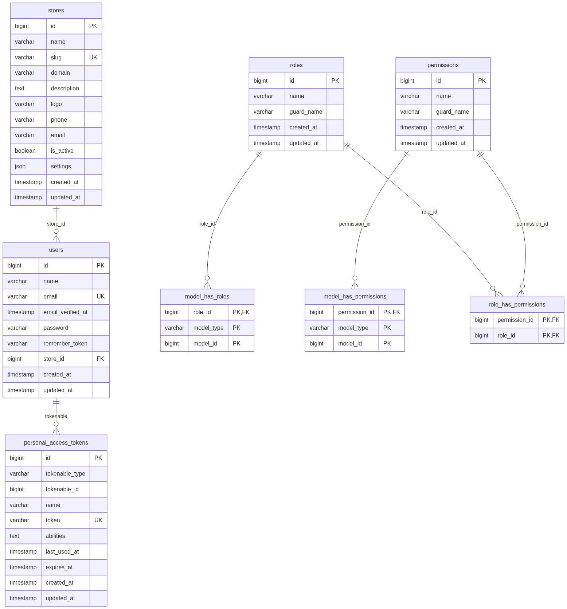
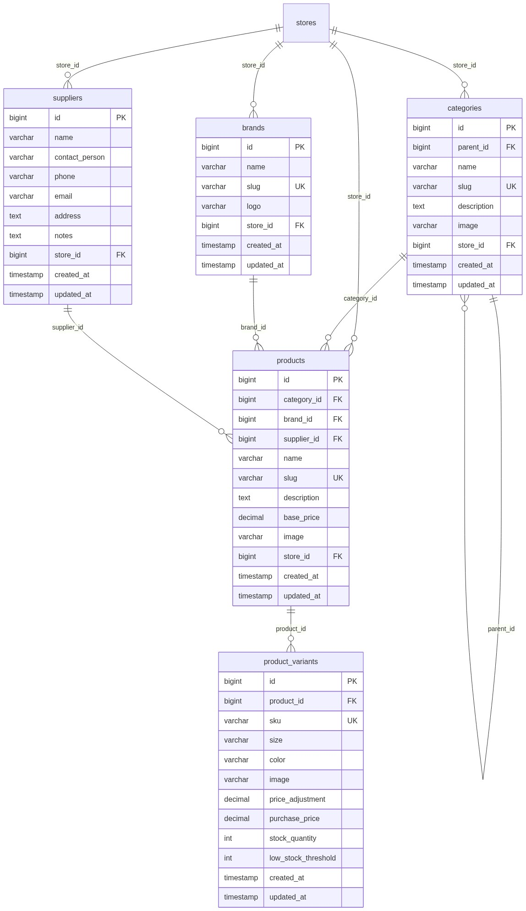
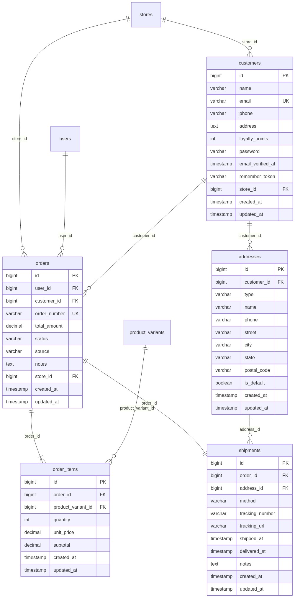
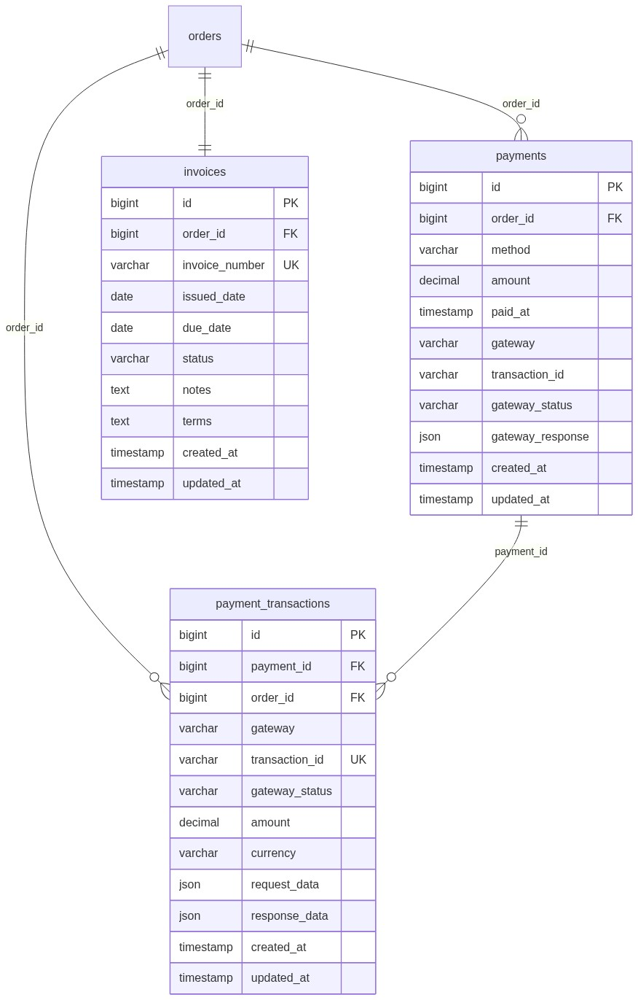
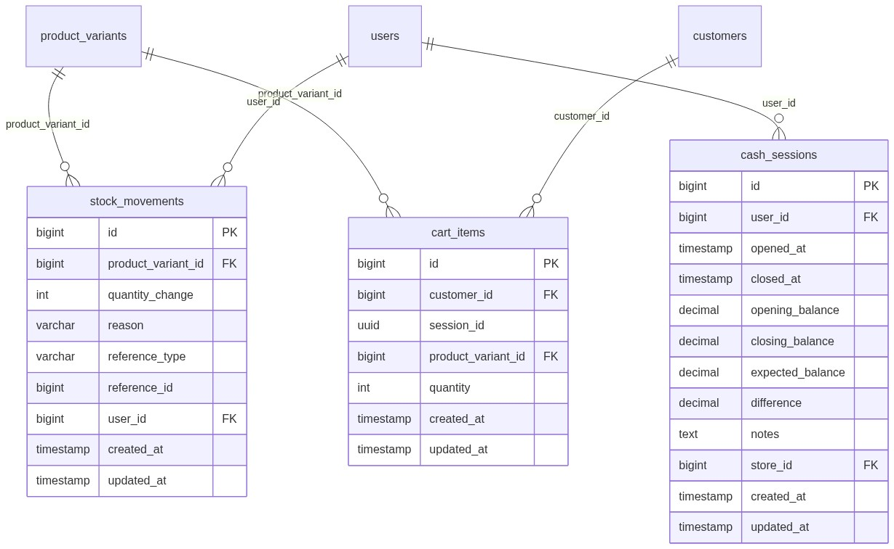
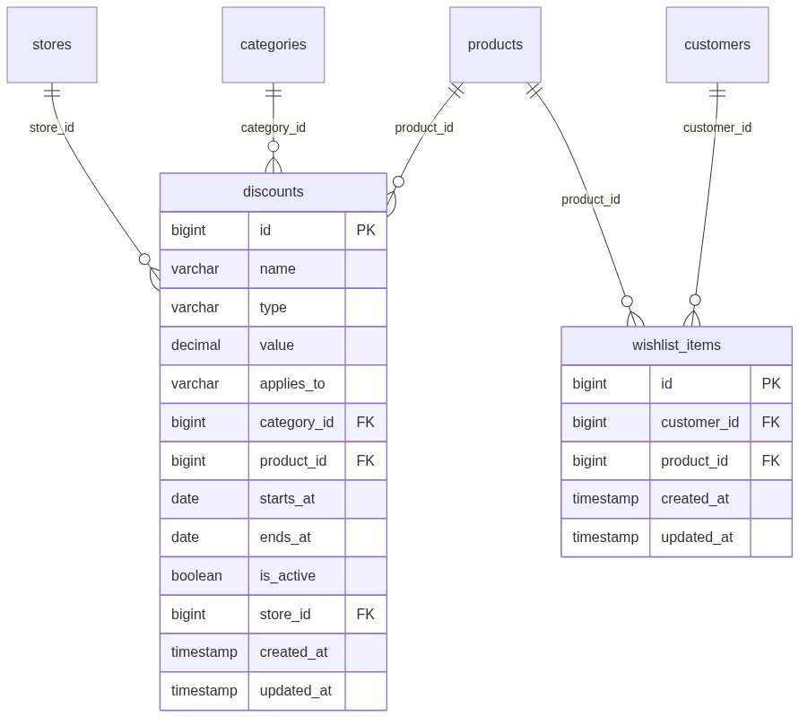
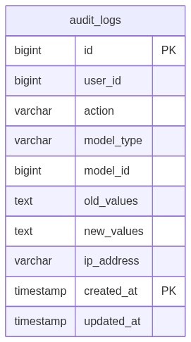
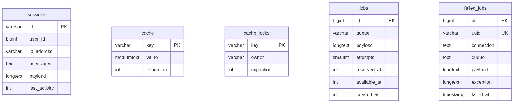

# SimpCommerce Database Schema

> Generated from 29 consolidated migrations. PostgreSQL target.

---

## Architecture Overview

```
┌──────────────────────────────────────────────────────────────────┐
│                    SimpCommerce Database                          │
├───────────────┬──────────────┬──────────────┬───────────────────┤
│  Core         │  Catalog     │  Orders      │  Operations       │
│  ─────────    │  ───────     │  ──────      │  ──────────       │
│  users        │  brands      │  orders      │  cash_sessions    │
│  stores       │  categories  │  order_items │  stock_movements  │
│  rbAC (5)     │  products    │  payments    │  cart_items       │
│  sessions     │  variants    │  invoices    │  wishlist_items   │
│  tokens       │  suppliers   │  shipments   │  discounts        │
│               │              │  addresses   │  audit_logs       │
│               │              │  customers   │                   │
└───────────────┴──────────────┴──────────────┴───────────────────┘
```

---

## Multi-Tenancy Model

**`stores`** is the tenant anchor. A single migration (`add_store_id_to_tables`) adds `store_id`
to 9 tables, backfills nulls with the default store, then enforces NOT NULL on operational tables.

| Table | store_id | Nullable | On Delete |
|---|---|---|---|
| `users` | FK → stores.id | **YES** | CASCADE |
| `customers` | FK → stores.id | **YES** | CASCADE |
| `products` | FK → stores.id | **NO** | CASCADE |
| `orders` | FK → stores.id | **NO** | CASCADE |
| `categories` | FK → stores.id | **NO** | CASCADE |
| `brands` | FK → stores.id | **NO** | CASCADE |
| `discounts` | FK → stores.id | **NO** | CASCADE |
| `suppliers` | FK → stores.id | **NO** | CASCADE |
| `cash_sessions` | FK → stores.id | **NO** | CASCADE |

> **Design rationale:** Users (staff/admins) and customers may exist without a store
> (e.g. root admin, guest checkout). All operational entities are store-scoped.

---

## 1. Core Identity & RBAC



**Spatie RBAC (5 tables):** `permissions`, `roles`, `model_has_permissions`, `model_has_roles`, `role_has_permissions` — polymorphic pivot tables supporting per-store role assignment on the `users` model (guard: `web`).

**Special notes:**
- `personal_access_tokens` uses polymorphic `tokenable` (shared across `users` and potentially `customers`)
- `sessions` table uses bare `user_id` index (no FK constraint for performance)

| Index | On | Purpose |
|---|---|---|
| `permissions_name_guard_name_unique` | (`name`, `guard_name`) | Unique permission per guard |
| `roles_name_guard_name_unique` | (`name`, `guard_name`) | Unique role per guard |
| `personal_access_tokens_expires_at_index` | (`expires_at`) | Token expiry cleanup |

---

## 2. Product Catalog



**Design notes:**
- `categories.parent_id` enables unlimited nesting via self-reference
- `product_variants` stores stock at the variant level; `low_stock_threshold` triggers alerts
- `purchase_price` on variants enables COGS/margin calculations
- `supplier_id` column is added by `create_suppliers_table` (not in products create)

**Performance indexes:**

| Index | On | Purpose |
|---|---|---|
| `idx_products_store_category` | (`store_id`, `category_id`) | Storefront category browsing |
| `idx_products_store_slug` | (`store_id`, `slug`) | Product detail page lookup |
| `idx_categories_store` | (`store_id`) | Category navigation |
| `brands_store_id_slug_unique` | (`store_id`, `slug`) | Scoped brand uniqueness |

---

## 3. Orders & Checkout



**Design notes:**
- `orders.user_id` is the staff member who created the order (POS); nullable for storefront self-checkout
- `orders.customer_id` is the buyer; nullable for walk-in/guest POS orders
- `orders.source`: `pos` (in-store) or `web` (storefront)
- `shipments.order_id` is unique (1:1 with orders)
- `shipments.address_id` uses RESTRICT on delete (prevents address deletion while shipping)

**Performance indexes:**

| Index | On | Purpose |
|---|---|---|
| `idx_orders_store_status_date` | (`store_id`, `status`, `created_at`) | Staff dashboard order list |
| `idx_orders_customer_date` | (`customer_id`, `created_at`) | Customer order history |
| `idx_customers_store_email` | (`store_id`, `email`) | Customer lookup by email |

---

## 4. Payments & Invoices



**Gateway architecture:**
- `payments.method`: `cash` (COD) or `card` (Stripe)
- `payments.gateway*` fields store gateway-specific transaction metadata
- `payment_transactions` is the audit trail for all gateway interactions (intents, charges, webhooks)
- `payment_transactions.transaction_id` is the gateway-side ID (e.g. Stripe `pi_xxx`)

**Performance indexes:**

| Index | On | Purpose |
|---|---|---|
| `idx_invoices_number` | (`invoice_number`) | Invoice lookup |

---

## 5. Inventory & Operations



**Design notes:**
- `stock_movements.reference_type` + `reference_id`: polymorphic (points to order, shipment, adjustment, etc.)
- `cart_items`: supports both authenticated (`customer_id`) and guest (`session_id` via UUID) carts
- `cash_sessions`: tracks POS register open/close with expected vs actual balance reconciliation

**Performance indexes:**

| Index | On | Purpose |
|---|---|---|
| `idx_stock_movements_variant_date` | (`product_variant_id`, `created_at`) | Inventory history lookup |
| `idx_cart_items_customer` | (`customer_id`) | Customer cart retrieval |
| `cart_items_session_id_index` | (`session_id`) | Guest cart retrieval |

---

## 6. Marketing & Engagement



**Design notes:**
- `discounts`: supports percentage/fixed types, can be scoped to all, category, or product
- `wishlist_items`: unique constraint on (`customer_id`, `product_id`) prevents duplicates

**Performance indexes:**

| Index | On | Purpose |
|---|---|---|
| `idx_wishlist_items_customer` | (`customer_id`) | Wishlist page load |

---

## 7. Audit & Logging



**PostgreSQL Partitioning:**
The `audit_logs` table is **range-partitioned by `created_at`** on PostgreSQL:

```
audit_logs (partitioned)
├── audit_logs_2026  [2026-01-01, 2027-01-01)
├── audit_logs_2027  [2027-01-01, 2028-01-01)
└── ...              (add partitions yearly)
```

> On non-PostgreSQL databases, the table remains unpartitioned.

**Performance indexes:**

| Index | On | Purpose |
|---|---|---|
| `idx_audit_logs_action_date` | (`action`, `created_at`) | Audit log filtering |

---

## 8. System Tables



**Indexes:** `sessions_user_id_index`, `sessions_last_activity_index`, `cache_expiration_index`, `cache_locks_expiration_index`, `jobs_queue_index`, `failed_jobs_connection_queue_failed_at_index`

---

## Foreign Key Cascade Summary

| Table | FK Column | References | On Delete |
|---|---|---|---|
| users | store_id | stores.id | **CASCADE** |
| customers | store_id | stores.id | **CASCADE** |
| products | category_id | categories.id | **CASCADE** |
| products | brand_id | brands.id | **SET NULL** |
| products | supplier_id | suppliers.id | **SET NULL** |
| products | store_id | stores.id | **CASCADE** |
| product_variants | product_id | products.id | **CASCADE** |
| categories | parent_id | categories.id | **SET NULL** |
| categories | store_id | stores.id | **CASCADE** |
| orders | user_id | users.id | **SET NULL** |
| orders | customer_id | customers.id | **SET NULL** |
| orders | store_id | stores.id | **CASCADE** |
| order_items | order_id | orders.id | **CASCADE** |
| order_items | product_variant_id | product_variants.id | **CASCADE** |
| payments | order_id | orders.id | **CASCADE** |
| invoices | order_id | orders.id | **CASCADE** |
| shipments | order_id | orders.id | **CASCADE** |
| shipments | address_id | addresses.id | **RESTRICT** |
| addresses | customer_id | customers.id | **CASCADE** |
| stock_movements | product_variant_id | product_variants.id | **CASCADE** |
| stock_movements | user_id | users.id | **SET NULL** |
| cash_sessions | user_id | users.id | **CASCADE** |
| cash_sessions | store_id | stores.id | **CASCADE** |
| cart_items | customer_id | customers.id | **CASCADE** |
| cart_items | product_variant_id | product_variants.id | **CASCADE** |
| discounts | category_id | categories.id | **SET NULL** |
| discounts | product_id | products.id | **SET NULL** |
| discounts | store_id | stores.id | **CASCADE** |
| wishlist_items | customer_id | customers.id | **CASCADE** |
| wishlist_items | product_id | products.id | **CASCADE** |
| payment_transactions | payment_id | payments.id | **SET NULL** |
| payment_transactions | order_id | orders.id | **SET NULL** |
| brands | store_id | stores.id | **CASCADE** |
| suppliers | store_id | stores.id | **CASCADE** |

---

## Index Map (beyond auto-created PK/FK/Unique)

```
products     → idx_products_store_category     (store_id, category_id)
products     → idx_products_store_slug         (store_id, slug)
categories   → idx_categories_store            (store_id)
orders       → idx_orders_store_status_date    (store_id, status, created_at)
orders       → idx_orders_customer_date        (customer_id, created_at)
stock_mvmts  → idx_stock_movements_variant_date(product_variant_id, created_at)
cart_items   → idx_cart_items_customer         (customer_id)
cart_items   → cart_items_session_id_index     (session_id)
wishlist     → idx_wishlist_items_customer     (customer_id)
invoices     → idx_invoices_number             (invoice_number)
audit_logs   → idx_audit_logs_action_date      (action, created_at)
customers    → idx_customers_store_email       (store_id, email)
sessions     → sessions_user_id_index          (user_id)
sessions     → sessions_last_activity_index    (last_activity)
cache        → cache_expiration_index          (expiration)
cache_locks  → cache_locks_expiration_index    (expiration)
jobs         → jobs_queue_index                (queue)
failed_jobs  → failed_jobs_connection_queue_failed_at (connection, queue, failed_at)
tokens       → personal_access_tokens_expires_at      (expires_at)
```

---

## Migration Order (29 files)

```
0001_01_01_000000  create_users_table              (users, password_reset_tokens, sessions)
0001_01_01_000001  create_cache_table              (cache, cache_locks)
0001_01_01_000002  create_jobs_table               (jobs, job_batches, failed_jobs)
2026_05_21_083345  create_brands_table
2026_05_21_083348  create_personal_access_tokens_table
2026_05_21_083349  create_categories_table
2026_05_21_083350  create_products_table
2026_05_21_083351  create_product_variants_table
2026_05_21_083352  create_customers_table
2026_05_21_083353  create_orders_table
2026_05_21_083354  create_order_items_table
2026_05_21_083355  create_payments_table
2026_05_21_083356  create_invoices_table
2026_05_21_083359  create_discounts_table
2026_05_21_083400  create_stock_movements_table
2026_05_21_083401  create_suppliers_table          (+ adds supplier_id to products)
2026_05_21_083403  create_cash_sessions_table
2026_05_21_083404  create_audit_logs_table
2026_05_22_000001  create_stores_table             (+ seeds default store)
2026_05_22_000002  add_store_id_to_tables          (+ backfill + NOT NULL for 7 tables)
2026_05_22_000003  create_cart_items_table
2026_05_22_000004  create_addresses_table
2026_05_22_000005  create_shipments_table
2026_06_02_000001  create_wishlist_items_table
2026_06_08_000001  add_scaling_indexes             (11 composite indexes)
2026_06_09_001321  partition_audit_logs            (audit_logs range partitioning, pgsql only)
2026_06_18_112632  create_permission_tables        (Spatie RBAC: 5 tables)
2026_06_26_083513  create_payment_transactions_table
2026_06_26_150758  make_brands_slug_store_scoped   (drops global UK → scoped UK)
```
