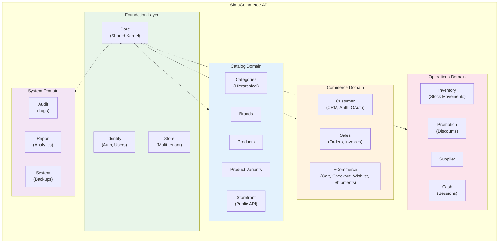
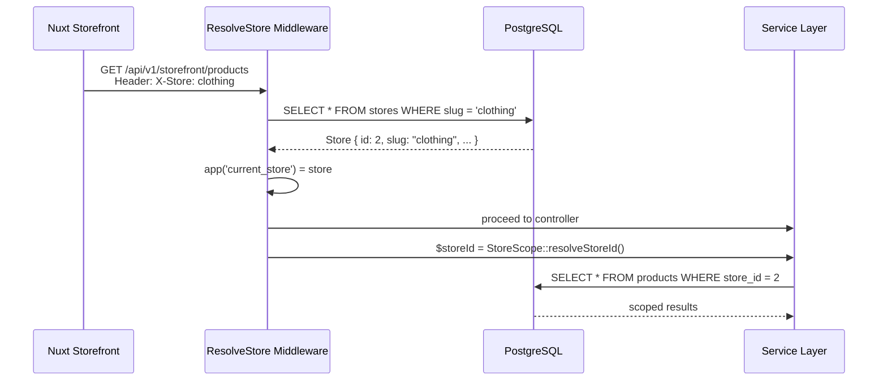
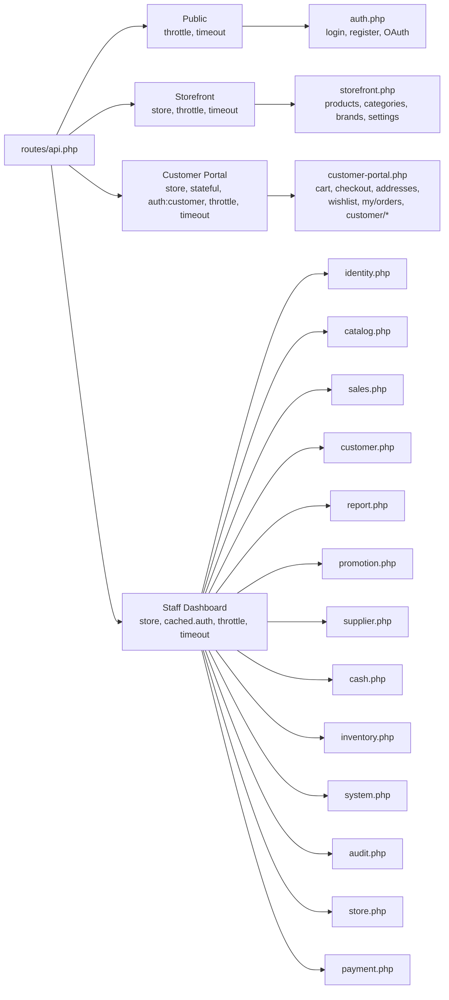
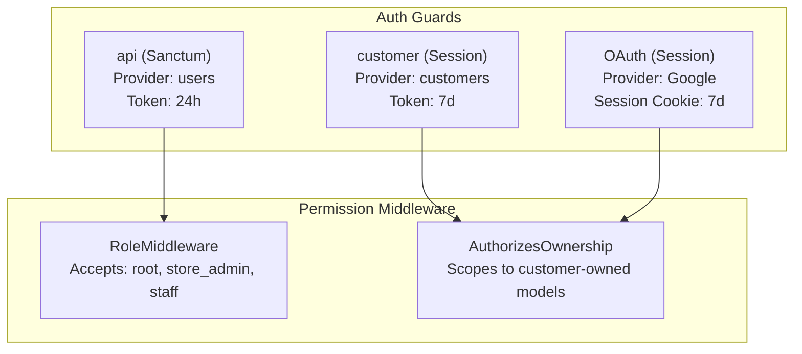
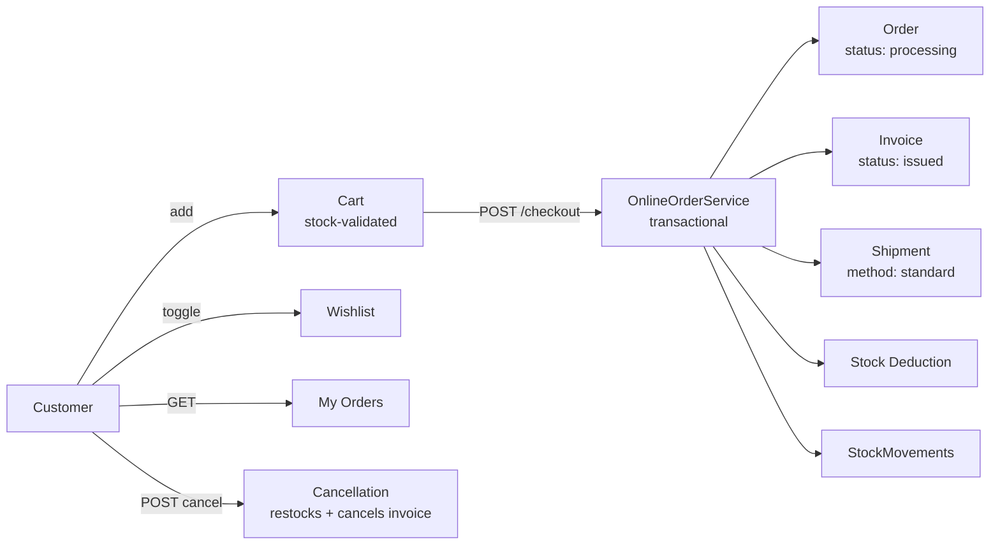

# SimpCommerce — Modular Monolith Architecture

> **Stack**: Laravel 13 · PHP 8.4 · PostgreSQL 16+ · 14 modules · 112 routes · 37 migrations

---

## 1. Motivation

A **Modular Monolith** gives clean domain separation within a single deployable unit — no microservices complexity, no network overhead, but disciplined module boundaries.

Driving requirements:

- **Multiple storefronts** — clothing, electronics, each with their own public Nuxt website
- **Multiple sales channels** — POS (in-store), online storefronts, future channels
- **Clear domain boundaries** — developers modify specific business areas without touching unrelated code

---

## 2. Module Map



**14 modules** organized into 5 domain layers, all sharing a common `Core` kernel.

| Layer | Module | Responsibility |
|-------|--------|---------------|
| Foundation | Core | Enums, traits (`ApiResponse`, `StoreScope`, `QueryFilter`, `AuthorizesOwnership`, `HandlesPasswordUpdate`), base `Repository` |
| Foundation | Identity | Staff auth (`AuthController`), user CRUD (`UserController`), profiles, role middleware |
| Foundation | Store | Multi-tenant store model, `ResolveStore` middleware |
| Catalog | Catalog | Products, variants, categories (with hierarchy), brands, CSV import/export, image management, storefront API |
| Commerce | Customer | Customer CRM, customer auth (register/login), OAuth (Google via Socialite), address book |
| Commerce | Sales | Orders (POS + online), invoices, payments, status transitions, returns |
| Commerce | ECommerce | Server-side cart, COD checkout, wishlist, shipments, customer order history |
| Operations | Inventory | Stock movements, stock service (atomic decrement/increment) |
| Operations | Promotion | Discounts (percentage/fixed, scoped to all/category/product) |
| Operations | Supplier | Supplier CRUD, store-scoped |
| Operations | Cash | Cash drawer sessions (open/close/reconcile) |
| System | Audit | Model change logging (created/updated/deleted with old/new values) |
| System | Report | Dashboard summary, sales reports, best-sellers, payment method analytics |
| System | System | Database backups (driver-aware: pg_dump/mysqldump/copy) |

---

## 3. Core Shared Kernel

`app/Modules/Core/` provides infrastructure consumed by all other modules. It has no HTTP layer.

| Component | Type | Purpose |
|-----------|------|---------|
| `Enums/` (11 files) | PHP 8.1+ backed enums | `UserRole`, `OrderStatus`, `OrderSource`, `InvoiceStatus`, `PaymentMethod`, `DiscountType`, `DiscountScope`, `StockMovementReason`, `ShipmentMethod`, `AddressType`, `AuditAction` |
| `ApiResponse` | Trait | `respond()` / `respondError()` / `respondMessage()` helpers for consistent JSON responses |
| `QueryFilter` | Trait | Eloquent scope: `scopeFilter($query, $filters)` — search/date/status filtering |
| `StoreScope` | Trait | `resolveStoreId()` — canonical method for multi-tenant store resolution |
| `AuthorizesOwnership` | Trait | `authorizeOwnership($model)` — gates for customer-owned resources |
| `HandlesPasswordUpdate` | Trait | `updatePasswordIfProvided()` — shared hash-on-update logic |
| `Repository` | Class | Base repository with common Eloquent query scaffolding |
| `PaginatesResults` | Trait | `resolvePerPage()` — standardizes pagination request validation and max 100 limit |

---

## 4. Multi-Store Architecture

### Resolution Flow



### Store-Scoped Tables

| Table | FK | Nullable | Scoped In |
|-------|-----|----------|-----------|
| `products` | `store_id` | Yes | Storefront, Staff |
| `categories` | `store_id` | Yes | Storefront, Staff |
| `brands` | `store_id` | No | Storefront, Staff |
| `orders` | `store_id` | Yes | Set at checkout |
| `customers` | `store_id` | Yes | Set at registration |
| `discounts` | `store_id` | Yes | Staff dashboard |
| `suppliers` | `store_id` | Yes | Staff dashboard |
| `cash_sessions` | `store_id` | Yes | Staff dashboard |
| `users` | `store_id` (FK) | Yes | Staff assignment |

**Design principle**: No global scopes. All store filtering is explicit via `->where('store_id', ...)`. The `StoreScope` trait provides the canonical `resolveStoreId()` helper used across all services.

---

## 5. API Route Architecture

`routes/api.php` is the master loader. Under a global `/v1` prefix group, it delegates to **16 per-module route files** organized into 4 middleware groups:



| Group | Middleware | Purpose |
|-------|-----------|---------|
| **Public** | `throttle:auth`, `timeout` | Staff login, customer register/login, OAuth |
| **Storefront** | `store`, `throttle:storefront`, `timeout`, `/storefront/*` | Public catalog browsing |
| **Customer** | `store`, `stateful`, `auth:customer`, `throttle:api`, `timeout` | Customer portal |
| **Staff** | `store`, `cached.auth`, `throttle:api`, `timeout` | Dashboard CRUD |

---

## 6. Service Layer

Business logic lives in dedicated service classes, not controllers. Each module has a `Services/` directory.

| Service | Module | Responsibility |
|---------|--------|---------------|
| `OrderService` | Sales | POS order creation, status transitions, item returns, stock orchestration |
| `InvoiceService` | Sales | Invoice creation, linking to orders |
| `InvoiceNumberGenerator` | Sales | DB-locked sequential `ORD-`/`INV-` number generation |
| `OnlineOrderService` | ECommerce | Transactional COD checkout (order + stock + invoice + shipment + cart clear) |
| `CartService` | ECommerce | Cart CRUD with stock validation |
| `WishlistService` | ECommerce | Wishlist toggle, listing, clearing |
| `MyOrderService` | ECommerce | Customer-facing order history and cancellation (with double-cancel guard) |
| `ProductService` | Catalog | Product + variant create/update/delete orchestration |
| `ProductImportService` | Catalog | CSV import with per-row validation, dispatched as `ProcessProductImportJob` |
| `ProductExportService` | Catalog | CSV export with headers |
| `StorefrontService` | Catalog | Store-scoped public product/category/brand/settings queries |
| `StorefrontCacheService` | Catalog | Caching layer for storefront responses |
| `MediaService` | Catalog | Image upload and storage (products, variants, categories, brands) |
| `CustomerService` | Customer | Customer management |
| `UserService` | Identity | Staff user management |
| `StockService` | Inventory | Atomic stock operations |
| `DiscountService` | Promotion | Discount application logic |
| `CashSessionService` | Cash | Session open/close with expected balance calculation |
| `DashboardService` | Report | Dashboard summary aggregation |
| `ReportService` | Report | Sales, best-sellers, payment-method analytics |
| `BackupService` | System | Driver-aware backup creation, dispatched as `CreateBackupJob` |

---

## 7. Repository Pattern

The `Core` module defines a base `Repository` class with common Eloquent query methods. All 14 modules use per-entity repositories for data access isolation.

| Repository | Module |
|-----------|--------|
| `UserRepository` | Identity |
| `StoreRepository` | Store |
| `ProductRepository`, `ProductVariantRepository`, `CategoryRepository`, `BrandRepository` | Catalog |
| `CustomerRepository`, `AddressRepository` | Customer |
| `OrderRepository`, `OrderItemRepository`, `InvoiceRepository`, `PaymentRepository` | Sales |
| `CartItemRepository`, `WishlistItemRepository`, `ShipmentRepository` | ECommerce |
| `StockMovementRepository` | Inventory |
| `DiscountRepository` | Promotion |
| `SupplierRepository` | Supplier |
| `CashSessionRepository` | Cash |
| `AuditLogRepository` | Audit |

---

## 8. Database Design Highlights

| Feature | Detail |
|---------|--------|
| **Engine** | PostgreSQL 16+ (production), SQLite in-memory (tests) |
| **Partitioning** | `audit_logs` and `orders` tables (range partitioning, migration `2026_06_09`) |
| **Performance indexes** | Added in migration `2026_06_08_000001` for scaling |
| **Number generation** | `ORD-{YYYYMMDD}-{XXXX}`, `INV-{YYYYMMDD}-{XXXX}` — sequential per date, DB-level locking via `InvoiceNumberGenerator` |
| **Category hierarchy** | Self-referencing `parent_id` FK on `categories` (migration `2026_06_10_111500`) |
| **Queue driver** | Database (`jobs` table), used by `ProcessProductImportJob` and `CreateBackupJob` |

---

## 9. Auth & Security Architecture



| Control | Implementation |
|---------|---------------|
| **Token auth** | Sanctum `auth:sanctum` guard with `personal_access_tokens` table |
| **Token lifetimes** | Staff: 24h, Customer: 7d |
| **Session auth** | `auth:customer` guard with stateful Sanctum sessions (OAuth flow) |
| **Role enforcement** | `RoleMiddleware` at route level — accepts array of allowed roles |
| **Cached token auth** | `CachedTokenAuth` middleware reduces DB hits on every request |
| **Rate limiting** | Auth: 10/min, API: 60/min, Checkout: 10/min + idempotency key |
| **Password policy** | Min 8 chars, uppercase + lowercase + digit |
| **OAuth security** | OAuth customers have `password = null`, cannot use password login |
| **CORS** | Configurable per environment via `config/cors.php` |

---

## 10. ECommerce Module



- **Cart**: Server-side, per-customer, stock-validated. Unit price = `product.base_price + variant.price_adjustment`.
- **COD Checkout**: Atomic transaction via `OnlineOrderService` — order + invoice + shipment + stock deduction + cart clear.
- **Idempotency**: `IdempotencyMiddleware` on checkout prevents duplicate orders from network retries.
- **Cancellation**: Processing orders only. Restocks with `StockMovement` (reason=Return). Double-cancel guarded.
- **Shipments**: Linked to address, tracks `shipped_at`/`delivered_at`, supports tracking numbers.

---

## 11. Directory Structure

```
simpcommerce-api/
├── app/
│   ├── Http/
│   │   └── Middleware/           # Idempotency, RequestTimeout
│   ├── Modules/                  # 14 domain modules
│   │   ├── Core/                 # Enums, Traits, Repository base
│   │   ├── Identity/             # Auth, Users, Profile, User model
│   │   ├── Store/                # Store model, ResolveStore middleware
│   │   ├── Catalog/              # Products, Variants, Categories, Brands, Storefront
│   │   ├── Customer/             # CRM, CustomerAuth, OAuth, AddressBook
│   │   ├── Sales/                # Orders, Invoices, Payments, order services
│   │   ├── ECommerce/            # Cart, Wishlist, Checkout, MyOrders, Shipments
│   │   ├── Inventory/            # StockMovement, StockService
│   │   ├── Promotion/            # Discount, DiscountService
│   │   ├── Supplier/             # Supplier CRUD
│   │   ├── Cash/                 # CashSession, CashSessionService
│   │   ├── Audit/                # AuditLog
│   │   ├── Report/               # Dashboard, Reports
│   │   └── System/               # Backups
│   └── Providers/                # Module service providers
├── database/
│   ├── factories/                # 16 model factories
│   ├── migrations/               # 37 migration files
│   └── seeders/                  # DatabaseSeeder
├── routes/
│   ├── api.php                   # Master route loader (4 middleware groups)
│   └── modules/                  # 15 per-module route files
├── docs/                         # ARCHITECTURE, SPECIFICATION, API, PRD, PROJECT_ANALYSIS
└── tests/
    ├── Feature/Api/              # 20 test files (147+ tests)
    └── ApiTestCase.php           # Base test case with helpers
```

Each module follows a consistent internal structure (not every module has all layers):
```
Module/
├── Http/Controllers/    # Request handling
├── Http/Resources/      # API resource transformers
├── Http/Requests/       # Form request validation
├── Models/              # Eloquent models
├── Services/            # Business logic
├── Repositories/        # Data access
├── Providers/           # Service providers
└── Jobs/                # Async jobs
```
