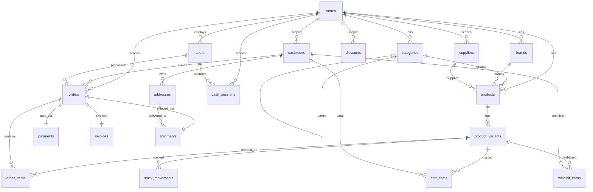
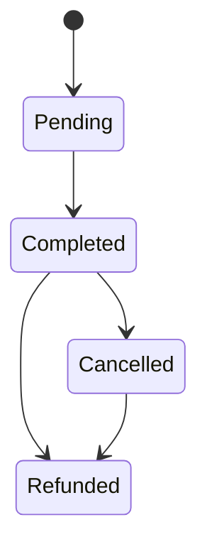
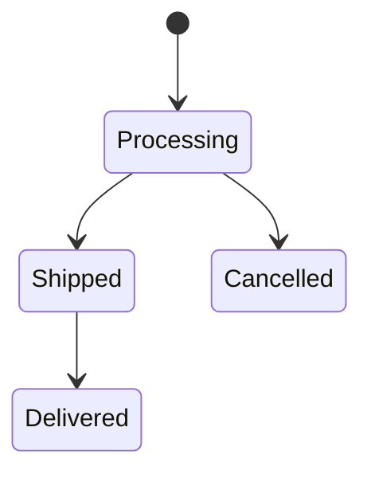

# SimpCommerce — Technical Specification

> **Authoritative source for**: tech stack, database schema, enums, security model, testing strategy.  
> For architecture decisions see [ARCHITECTURE.md](./ARCHITECTURE.md).  
> For API reference see [API.md](./API.md).  
> For product requirements see [PRD.md](./PRD.md).

---

## 1. Tech Stack

| Layer | Technology | Version |
|-------|-----------|---------|
| Runtime | PHP | 8.4+ |
| Framework | Laravel | 13 |
| Database (production) | PostgreSQL | 16+ |
| Database (testing) | SQLite | in-memory |
| Staff Auth | Laravel Sanctum | 4.x |
| Customer Auth | Laravel Sanctum | 4.x |
| OAuth | Laravel Socialite | 5.x (Google) |
| PDF Generation | barryvdh/laravel-dompdf | — |
| Queue | Database driver (`jobs` table) | — |
| Monitoring | Laravel Nightwatch | 1.x |
| Testing | PHPUnit | 12 |
| Code Style | Laravel Pint | 1.x |
| Dashboard Frontend | Vue 3 + TypeScript + Vite | — |
| Dashboard UI | Shadcn/vue + Tailwind CSS | v4 |
| Dashboard State | Pinia | — |
| Dashboard Charts | Chart.js + vue-chartjs | — |
| Dashboard i18n | vue-i18n | — |
| Storefront | Nuxt 4 SSR (separate repos per store) | — |

---

## 2. Database Schema

### 2.1 Full Table Reference

#### `users`
Staff dashboard accounts with role-based access.

| Column | Type | Constraints |
|--------|------|-------------|
| `id` | BIGINT | PK, AUTO_INCREMENT |
| `name` | VARCHAR(255) | NOT NULL |
| `email` | VARCHAR(255) | UNIQUE, NOT NULL |
| `password` | VARCHAR(255) | NOT NULL |
| `store_id` | BIGINT | FK → `stores.id`, NOT NULL |
| `remember_token` | VARCHAR(100) | NULL |
| timestamps | — | `created_at`, `updated_at` |

#### `stores`
Multi-tenant store configurations.

| Column | Type | Constraints |
|--------|------|-------------|
| `id` | BIGINT | PK, AUTO_INCREMENT |
| `name` | VARCHAR(255) | NOT NULL |
| `slug` | VARCHAR(255) | UNIQUE, NOT NULL |
| `domain` | VARCHAR(255) | NULL |
| `description` | TEXT | NULL |
| `logo` | VARCHAR(255) | NULL |
| `phone` | VARCHAR(255) | NULL |
| `email` | VARCHAR(255) | NULL |
| `is_active` | BOOLEAN | DEFAULT true |
| `settings` | JSON | NULL |
| timestamps | — | `created_at`, `updated_at` |

#### `categories`
Product categories with self-referencing hierarchy support.

| Column | Type | Constraints |
|--------|------|-------------|
| `id` | BIGINT | PK, AUTO_INCREMENT |
| `name` | VARCHAR(255) | NOT NULL |
| `slug` | VARCHAR(255) | NOT NULL |
| `description` | TEXT | NULL |
| `image` | VARCHAR(255) | NULL |
| `parent_id` | BIGINT | FK → `categories.id`, NULL |
| `store_id` | BIGINT | FK → `stores.id`, NULL |
| timestamps | — | `created_at`, `updated_at` |

#### `brands`
Product brands, store-scoped.

| Column | Type | Constraints |
|--------|------|-------------|
| `id` | BIGINT | PK, AUTO_INCREMENT |
| `name` | VARCHAR(255) | NOT NULL |
| `slug` | VARCHAR(255) | NOT NULL |
| `logo` | VARCHAR(255) | NULL |
| `store_id` | BIGINT | FK → `stores.id`, NOT NULL, CASCADE DELETE |
| timestamps | — | `created_at`, `updated_at` |
| unique | — | `(store_id, slug)` |

#### `products`
Product catalog entries.

| Column | Type | Constraints |
|--------|------|-------------|
| `id` | BIGINT | PK, AUTO_INCREMENT |
| `category_id` | BIGINT | FK → `categories.id`, NOT NULL |
| `brand_id` | BIGINT | FK → `brands.id`, NULL |
| `supplier_id` | BIGINT | FK → `suppliers.id`, NULL |
| `store_id` | BIGINT | FK → `stores.id`, NULL |
| `name` | VARCHAR(255) | NOT NULL |
| `slug` | VARCHAR(255) | NOT NULL |
| `description` | TEXT | NULL |
| `base_price` | DECIMAL(10,2) | NOT NULL |
| `image` | VARCHAR(255) | NULL |
| timestamps | — | `created_at`, `updated_at` |

#### `product_variants`
Size/color variants with stock tracking.

| Column | Type | Constraints |
|--------|------|-------------|
| `id` | BIGINT | PK, AUTO_INCREMENT |
| `product_id` | BIGINT | FK → `products.id`, NOT NULL |
| `sku` | VARCHAR(255) | UNIQUE, NOT NULL |
| `size` | VARCHAR(255) | NULL |
| `color` | VARCHAR(255) | NULL |
| `image` | VARCHAR(255) | NULL |
| `price_adjustment` | DECIMAL(10,2) | DEFAULT 0 |
| `purchase_price` | DECIMAL(10,2) | NULL |
| `stock_quantity` | INTEGER | DEFAULT 0 |
| timestamps | — | `created_at`, `updated_at` |

#### `customers`
Customer portal accounts (Authenticatable via Sanctum + OAuth).

| Column | Type | Constraints |
|--------|------|-------------|
| `id` | BIGINT | PK, AUTO_INCREMENT |
| `name` | VARCHAR(255) | NOT NULL |
| `email` | VARCHAR(255) | UNIQUE, NULL — null for walk-in/OAuth |
| `phone` | VARCHAR(255) | NULL |
| `address` | TEXT | NULL |
| `loyalty_points` | INTEGER | DEFAULT 0 |
| `password` | VARCHAR(255) | NULL — null for OAuth-only customers |
| `email_verified_at` | TIMESTAMP | NULL |
| `remember_token` | VARCHAR(100) | NULL |
| `store_id` | BIGINT | FK → `stores.id`, NULL |
| timestamps | — | `created_at`, `updated_at` |

#### `addresses`
Customer shipping/billing addresses.

| Column | Type | Constraints |
|--------|------|-------------|
| `id` | BIGINT | PK, AUTO_INCREMENT |
| `customer_id` | BIGINT | FK → `customers.id`, NOT NULL |
| `type` | VARCHAR(255) | NOT NULL — `shipping`, `billing` |
| `name` | VARCHAR(255) | NOT NULL |
| `phone` | VARCHAR(255) | NOT NULL |
| `street` | VARCHAR(255) | NOT NULL |
| `city` | VARCHAR(255) | NOT NULL |
| `state` | VARCHAR(255) | NOT NULL |
| `postal_code` | VARCHAR(255) | NOT NULL |
| `is_default` | BOOLEAN | DEFAULT false |
| timestamps | — | `created_at`, `updated_at` |

#### `orders`
Sales orders from POS and online channels.

| Column | Type | Constraints |
|--------|------|-------------|
| `id` | BIGINT | PK, AUTO_INCREMENT |
| `user_id` | BIGINT | FK → `users.id`, NULL |
| `customer_id` | BIGINT | FK → `customers.id`, NULL |
| `store_id` | BIGINT | FK → `stores.id`, NULL |
| `order_number` | VARCHAR(255) | UNIQUE, NOT NULL |
| `total_amount` | DECIMAL(10,2) | NOT NULL |
| `source` | VARCHAR(255) | NOT NULL — `pos`, `online` |
| `status` | VARCHAR(255) | NOT NULL — see OrderStatus enum |
| `notes` | TEXT | NULL |
| timestamps | — | `created_at`, `updated_at` |

#### `order_items`
Line items within orders. Prices frozen at order time.

| Column | Type | Constraints |
|--------|------|-------------|
| `id` | BIGINT | PK, AUTO_INCREMENT |
| `order_id` | BIGINT | FK → `orders.id`, NOT NULL |
| `product_variant_id` | BIGINT | FK → `product_variants.id`, NOT NULL |
| `quantity` | INTEGER | NOT NULL |
| `unit_price` | DECIMAL(10,2) | NOT NULL |
| `subtotal` | DECIMAL(10,2) | NOT NULL |
| timestamps | — | `created_at`, `updated_at` |

#### `payments`
Payments linked to orders.

| Column | Type | Constraints |
|--------|------|-------------|
| `id` | BIGINT | PK, AUTO_INCREMENT |
| `order_id` | BIGINT | FK → `orders.id`, UNIQUE, NOT NULL |
| `method` | VARCHAR(255) | NOT NULL — `cash`, `transfer` |
| `amount` | DECIMAL(10,2) | NOT NULL |
| `paid_at` | TIMESTAMP | NULL |
| timestamps | — | `created_at`, `updated_at` |

#### `payment_transactions`
Tracks individual payment gateway transactions for audit and reconciliation.

| Column | Type | Constraints |
|--------|------|-------------|
| `id` | BIGINT | PK, AUTO_INCREMENT |
| `payment_id` | BIGINT | FK → `payments.id`, NULL, NULL_ON_DELETE |
| `order_id` | BIGINT | FK → `orders.id`, NULL, NULL_ON_DELETE |
| `gateway` | VARCHAR(255) | NOT NULL |
| `transaction_id` | VARCHAR(255) | NOT NULL |
| `gateway_status` | VARCHAR(255) | DEFAULT 'pending', NOT NULL |
| `amount` | DECIMAL(10,2) | NOT NULL |
| `currency` | VARCHAR(3) | DEFAULT 'MMK', NOT NULL |
| `request_data` | JSON | NULL |
| `response_data` | JSON | NULL |
| timestamps | — | `created_at`, `updated_at` |

#### `invoices`
Financial documents linked to orders.

| Column | Type | Constraints |
|--------|------|-------------|
| `id` | BIGINT | PK, AUTO_INCREMENT |
| `order_id` | BIGINT | FK → `orders.id`, UNIQUE, NOT NULL |
| `invoice_number` | VARCHAR(255) | UNIQUE, NOT NULL |
| `issued_date` | DATE | NOT NULL |
| `due_date` | DATE | NOT NULL |
| `status` | VARCHAR(255) | NOT NULL — see InvoiceStatus enum |
| `notes` | TEXT | NULL |
| `terms` | TEXT | NULL |
| timestamps | — | `created_at`, `updated_at` |

#### `discounts`
Promotional discounts with type and scope.

| Column | Type | Constraints |
|--------|------|-------------|
| `id` | BIGINT | PK, AUTO_INCREMENT |
| `name` | VARCHAR(255) | NOT NULL |
| `type` | VARCHAR(255) | NOT NULL — `percentage`, `fixed` |
| `value` | DECIMAL(10,2) | NOT NULL |
| `applies_to` | VARCHAR(255) | NOT NULL — `all`, `category`, `product` |
| `category_id` | BIGINT | FK → `categories.id`, NULL |
| `product_id` | BIGINT | FK → `products.id`, NULL |
| `store_id` | BIGINT | FK → `stores.id`, NULL |
| `starts_at` | TIMESTAMP | NULL |
| `ends_at` | TIMESTAMP | NULL |
| `is_active` | BOOLEAN | DEFAULT true |
| timestamps | — | `created_at`, `updated_at` |

#### `stock_movements`
Audit trail for all inventory changes.

| Column | Type | Constraints |
|--------|------|-------------|
| `id` | BIGINT | PK, AUTO_INCREMENT |
| `product_variant_id` | BIGINT | FK → `product_variants.id`, NOT NULL |
| `quantity_change` | INTEGER | NOT NULL — positive for addition, negative for deduction |
| `reason` | VARCHAR(255) | NOT NULL — see StockMovementReason enum |
| `reference_type` | VARCHAR(255) | NULL — polymorphic reference |
| `reference_id` | BIGINT | NULL |
| `user_id` | BIGINT | FK → `users.id`, NULL |
| timestamps | — | `created_at`, `updated_at` |

#### `suppliers`
Vendor/supplier records.

| Column | Type | Constraints |
|--------|------|-------------|
| `id` | BIGINT | PK, AUTO_INCREMENT |
| `name` | VARCHAR(255) | NOT NULL |
| `contact_person` | VARCHAR(255) | NULL |
| `phone` | VARCHAR(255) | NULL |
| `email` | VARCHAR(255) | NULL |
| `address` | TEXT | NULL |
| `notes` | TEXT | NULL |
| `store_id` | BIGINT | FK → `stores.id`, NULL |
| timestamps | — | `created_at`, `updated_at` |

#### `cash_sessions`
Cash register shift tracking.

| Column | Type | Constraints |
|--------|------|-------------|
| `id` | BIGINT | PK, AUTO_INCREMENT |
| `user_id` | BIGINT | FK → `users.id`, NOT NULL |
| `store_id` | BIGINT | FK → `stores.id`, NULL |
| `opened_at` | TIMESTAMP | NOT NULL |
| `closed_at` | TIMESTAMP | NULL |
| `opening_balance` | DECIMAL(10,2) | NOT NULL |
| `closing_balance` | DECIMAL(10,2) | NULL |
| `expected_balance` | DECIMAL(10,2) | NULL |
| `difference` | DECIMAL(10,2) | NULL |
| `notes` | TEXT | NULL |
| timestamps | — | `created_at`, `updated_at` |

#### `cart_items`
Server-side shopping cart.

| Column | Type | Constraints |
|--------|------|-------------|
| `id` | BIGINT | PK, AUTO_INCREMENT |
| `customer_id` | BIGINT | FK → `customers.id`, NOT NULL |
| `product_variant_id` | BIGINT | FK → `product_variants.id`, NOT NULL |
| `quantity` | INTEGER | NOT NULL |
| timestamps | — | `created_at`, `updated_at` |

#### `wishlist_items`
Customer wishlist (toggle-based).

| Column | Type | Constraints |
|--------|------|-------------|
| `id` | BIGINT | PK, AUTO_INCREMENT |
| `customer_id` | BIGINT | FK → `customers.id`, NOT NULL |
| `product_variant_id` | BIGINT | FK → `product_variants.id`, NOT NULL |
| timestamps | — | `created_at`, `updated_at` |

#### `shipments`
Order delivery tracking.

| Column | Type | Constraints |
|--------|------|-------------|
| `id` | BIGINT | PK, AUTO_INCREMENT |
| `order_id` | BIGINT | FK → `orders.id`, NOT NULL |
| `address_id` | BIGINT | FK → `addresses.id`, NOT NULL |
| `method` | VARCHAR(255) | NOT NULL — `cod`, `standard`, `express` |
| `tracking_number` | VARCHAR(255) | NULL |
| `tracking_url` | VARCHAR(255) | NULL |
| `shipped_at` | TIMESTAMP | NULL |
| `delivered_at` | TIMESTAMP | NULL |
| `notes` | TEXT | NULL |
| timestamps | — | `created_at`, `updated_at` |

#### `audit_logs`
Activity log for all model changes (partitioned table).

| Column | Type | Constraints |
|--------|------|-------------|
| `id` | BIGINT | PK, AUTO_INCREMENT |
| `user_id` | BIGINT | FK → `users.id`, NULL |
| `action` | VARCHAR(255) | NOT NULL — `created`, `updated`, `deleted` |
| `model_type` | VARCHAR(255) | NOT NULL |
| `model_id` | BIGINT | NOT NULL |
| `old_values` | JSON | NULL |
| `new_values` | JSON | NULL |
| `ip_address` | VARCHAR(45) | NULL |
| timestamps | — | `created_at`, `updated_at` |

### 2.2 Entity Relationship Diagram

---

## 3. Enums

All domain string values use PHP 8.1+ backed enums in `app/Modules/Core/Enums/`.

### 3.1 Auth & Access

| Enum | Values | Used In |
|------|--------|---------|
| `UserRole` | `Root`, `StoreAdmin`, `Staff` | `users.role`, `RoleMiddleware` |

### 3.2 Order & Sales

| Enum | Values | Used In |
|------|--------|---------|
| `OrderStatus` | `Pending`, `Processing`, `Completed`, `Shipped`, `Delivered`, `Cancelled`, `Refunded` | `orders.status` |
| `OrderSource` | `Pos`, `Online` | `orders.source` |
| `InvoiceStatus` | `Draft`, `Issued`, `Paid`, `Cancelled`, `Overdue` | `invoices.status` |
| `PaymentMethod` | `Cash`, `Transfer` | `payments.method` |
| `ShipmentMethod` | `Cod`, `Standard`, `Express` | `shipments.method` |

### 3.3 Catalog & Inventory

| Enum | Values | Used In |
|------|--------|---------|
| `DiscountType` | `Percentage`, `Fixed` | `discounts.type` |
| `DiscountScope` | `All`, `Category`, `Product` | `discounts.applies_to` |
| `StockMovementReason` | `Sale`, `Purchase`, `Adjustment`, `Return` | `stock_movements.reason` |
| `AddressType` | `Shipping`, `Billing` | `addresses.type` |

### 3.4 System

| Enum | Values | Used In |
|------|--------|---------|
| `AuditAction` | `Created`, `Updated`, `Deleted` | `audit_logs.action` |

---

## 4. Order Status Transitions

### POS Orders (`source: pos`)

### Online Orders (`source: online`)

---

## 5. Security & Validation

| Control | Implementation |
|---------|---------------|
| **Staff auth** | Sanctum Bearer token, `auth:sanctum` guard, 24h expiry, cached token middleware |
| **Customer auth** | Sanctum Bearer token, `auth:customer` guard, 7d expiry |
| **OAuth auth** | Socialite → Google → Session cookie, `password = null` for OAuth-only accounts |
| **Role enforcement** | `RoleMiddleware` on routes — accepts `root | store_admin | staff` |
| **Rate limiting** | Auth endpoints: 10/min · General API: 60/min · Checkout: 10/min |
| **Password policy** | Min 8 characters, must contain uppercase, lowercase, and digit |
| **Stock validation** | Row-lock queries at checkout (`->lockForUpdate()`) |
| **Idempotency** | `IdempotencyMiddleware` on checkout; double-cancel guard on order cancellation |
| **Input validation** | `FormRequest` classes on all endpoints |
| **Backup security** | `basename()` strips path traversal on download |
| **Secrets** | All credentials via `.env`; no keys in codebase |

---

## 6. Numbering Conventions

| Entity | Format | Example | Generator |
|--------|--------|---------|-----------|
| Order Number | `ORD-{YYYYMMDD}-{XXXX}` | `ORD-20260611-0001` | `InvoiceNumberGenerator` |
| Invoice Number | `INV-{YYYYMMDD}-{XXXX}` | `INV-20260611-0001` | `InvoiceNumberGenerator` |

Sequential per date, resets daily. Database-level locking via `LOCK TABLE` to prevent race conditions.

---

## 7. Testing

| Metric | Value |
|--------|-------|
| Framework | PHPUnit 12 |
| Test files | 20 feature test files |
| Test count | 147+ (all passing) |
| Database | SQLite in-memory (`phpunit.xml`) |
| Run command | `php artisan test --compact` |

**Coverage**: Auth, Products, Variants, Categories, Customers, Orders, Invoices, Discounts, Suppliers, Stock Movements, Cash Sessions, Returns, Reports, Dashboard, Users, Profile, Backups, Storefront, OAuth.

**Conventions**:
- `ApiTestCase` base class provides `actingAs(User|Customer)` helpers
- Factories used for all test data; no hardcoded fixtures
- Each endpoint tested for happy path, validation errors, and auth/role failures
